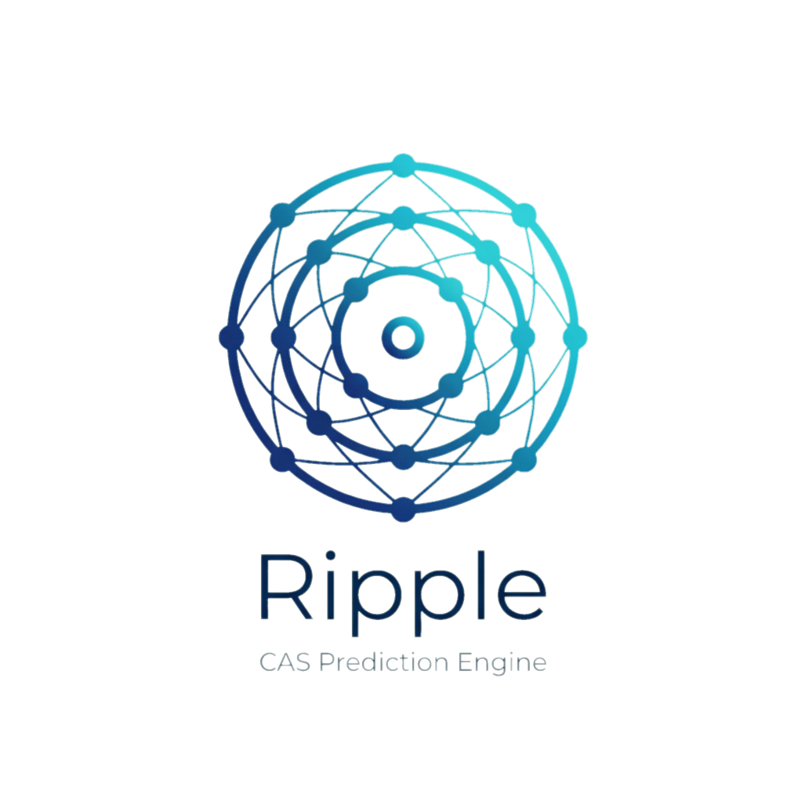
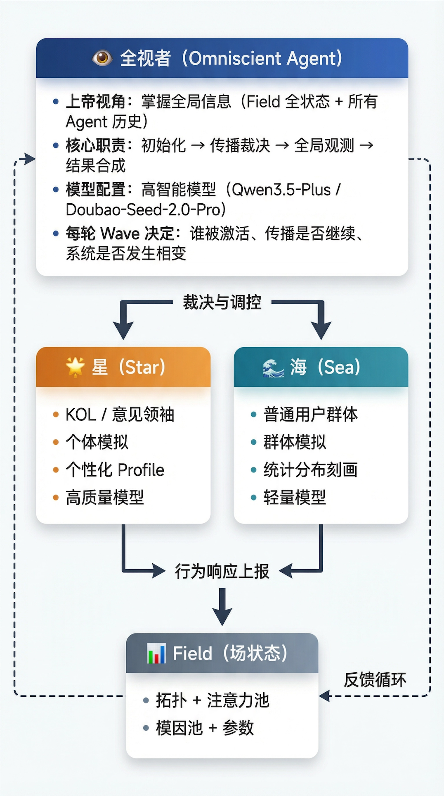
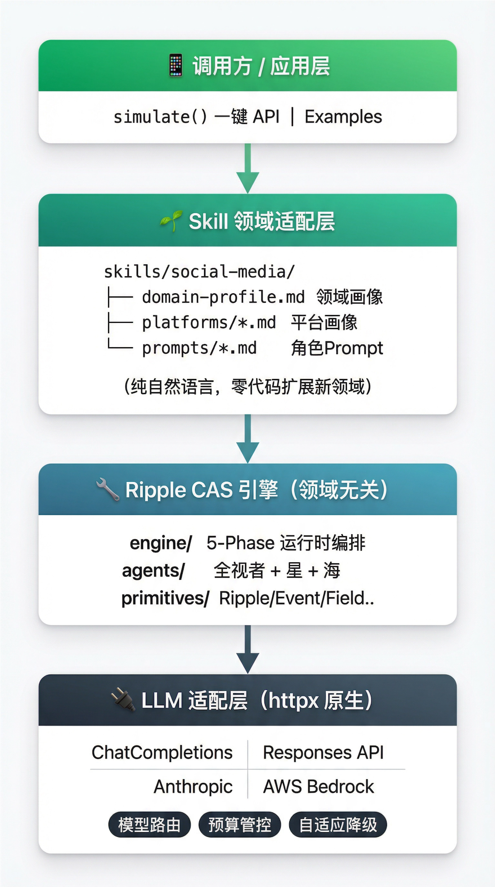

<p align="center">
  
</p>

<h1 align="center">Ripple（涟漪）</h1>

<p align="center">
  <strong>🌊 基于复杂自适应系统（CAS）理论的 Agent-Native 通用人类社会行为预测引擎</strong>
</p>

<p align="center">
  <a href="README.md">中文</a> | <a href="README_EN.md">English</a>
</p>

<p align="center">
  
  
  
  
  
  <a href="mailto:xypluslab@gmail.com"></a>
</p>

---

<details>
<summary><strong>📑 目录</strong></summary>

1. [项目简介](#-项目简介)
2. [设计理念](#-设计理念)
3. [核心概念：CAS 如何驱动预测](#-核心概念cas-如何驱动预测)
4. [星海架构](#-星海架构)
5. [五相运行时引擎](#-五相运行时引擎)
6. [系统架构](#-系统架构)
7. [快速开始](#-快速开始)
8. [成本对比](#-成本对比)
9. [社交媒体：第一个领域实现](#-社交媒体第一个领域实现)
10. [无限可能](#-无限可能)
11. [工程结构](#-工程结构)
12. [项目状态](#-项目状态)
13. [技术栈](#-技术栈)
14. [灵感来源：OASIS](#-灵感来源oasis)
15. [致谢](#-致谢)
16. [许可证](#-许可证)

</details>

---

## 🌊 项目简介

**Ripple（涟漪）** 是一个基于 **复杂自适应系统（Complex Adaptive System, CAS）理论** 构建的 **Agent-Native 通用人类社会行为预测引擎**。

社会中的信息传播犹如水面的涟漪——一颗石子投入水中，波纹从中心向外扩散，与其他波纹相遇时产生叠加、干涉、共振或抵消。Ripple 将这一物理直觉编码为可计算的引擎：**信号在智能体间传播能量，产生涌现、非线性放大、反馈环和相变**——这也正是本项目名称的由来。

**社交媒体内容传播模拟**是 Ripple 实现的第一个应用场景：输入一条计划发布的内容，系统通过多智能体模拟，输出含置信度的传播预测、系统动力学诊断和可操作的优化建议。

### 项目定位

- 🔬 独立项目，灵感来自 [OASIS](https://github.com/camel-ai/oasis) 的多智能体社交模拟思路
- 🎯 面向实际应用场景（内容创作、产品市场分析、舆论研判），而非学术研究
- 🌐 CAS 内核完全领域无关，社交媒体只是第一个应用场景
- ⚡ 追求极致的实用性和成本效率——相比 OASIS，LLM 调用量压缩约 **3 个数量级**

---

## 💡 设计理念

### 1. 🌊 动力学基础——涟漪

信号犹如涟漪一般在智能体网络中传播能量。每个智能体接收涟漪后，根据自身特征决定响应方式——放大、吸收、变异或忽略——产生的新涟漪继续向外传播。涟漪携带能量并自然衰减，多条涟漪在节点处叠加时可能触发非线性效应，这是系统产生涌现行为的根本机制。

### 2. 👥 群体模拟范式

一改 OASIS "一人一 Agent" 的个体模拟架构，Ripple 采用**群体模拟**思路。真实社交网络中，大多数普通用户的行为呈现群体统计特征——Ripple 将具有相似属性的用户聚合为一个群体智能体，用统计分布替代逐人模拟，将 **LLM 调用数量降低约 3 个数量级**，同时通过 CAS 理论框架保留了涌现行为的捕捉能力。

### 3. ⭐🌊 独创"星海架构"

Ripple 提出独创的 **星海（Star-Sea）三体智能体架构**：

- **🌟 星（Star）智能体**：高声量个体（KOL/意见领袖）延续个体模拟，保留个性化决策能力
- **🌊 海（Sea）智能体**：普通用户群体采用群体模拟，以统计分布刻画集体行为
- **👁️ 全视者（Omniscient）智能体**：上帝视角的全局编排者，统筹传播裁决、环境观测与系统调控

三者协同形成 **"个体精准 + 群体高效 + 全局统筹"** 的最优资源分配格局。

### 4. 🤖 Agent-Native

将决策权**完全交给大模型**，充分发挥 LLM 的涌现能力。没有硬编码的 CAS 参数、没有预设的传播路径——所有动力学行为由全视者智能体基于全局上下文进行实时推断。系统的智能不来自预定义的规则，而来自 LLM 对复杂系统动态的深度理解。

### 5. ✨ 极简设计

尽可能简化系统架构：**未使用任何三方 Agent 框架**，纯 Python + httpx 直连多家 LLM API。17 个核心模块，约 5,300 行源代码——追求用最少的代码实现最完整的 CAS 模拟能力。

### 6. 🧩 领域分离与 Skill 架构

核心 CAS 引擎完全领域无关——不知道什么是"点赞"、"流量池"或"CES 分数"。所有领域知识通过 **Skill 包** 注入：纯自然语言的领域画像 + 平台画像 + 角色 Prompt，实现**零代码扩展新领域**。

### 7. 🔍 直观可追溯

模拟过程全链路可观测：每一轮 Wave 的全视者裁决、每个智能体的响应决策、涟漪的传播路径和能量变化——全部增量记录为结构化 JSON。预测结果附带**置信度评估**，让用户清楚知道模型"多确定"或"多不确定"。

---

## 🔬 核心概念：CAS 如何驱动预测

人类社会行为天然具有**复杂自适应系统（CAS）**的核心特征。Ripple 将这些特征编码为引擎的核心原语：

| CAS 特征 | 含义 | Ripple 中的实现 | 现实世界的例子 |
|----------|------|----------------|---------------|
| **涌现（Emergence）** | 宏观行为从微观交互中自发产生 | 全视者观测 + 涌现检测 | 病毒式传播、市场泡沫、社会运动 |
| **非线性（Non-linearity）** | 微小扰动可能引发巨大效应 | 涟漪能量传播 + 叠加效应 | 一次转发触发级联、技术采纳 S 曲线 |
| **正反馈环（Positive Feedback）** | 自我强化的增长循环 | 全视者动态调控传播裁决 | 高互动→算法推荐→更多曝光 |
| **负反馈环（Negative Feedback）** | 自我抑制的制动机制 | 能量衰减 + 注意力竞争 | 内容疲劳、审美饱和、市场饱和 |
| **相变（Phase Transition）** | 系统在不同宏观状态间突变 | PhaseVector 多维相态跟踪 | 内容传播"引爆点"、舆论翻转 |
| **初始条件敏感性** | 初始的微小差异导致截然不同的结果 | 种子用户差异化响应 | 首批用户决定产品扩散路径 |
| **适应性（Adaptation）** | 智能体根据环境变化调整行为 | Star/Sea 基于上下文的 LLM 决策 | 用户跟随热点、规避负面话题 |

### Ripple 核心原语

| 原语 | 定义 | 在引擎中的角色 |
|------|------|---------------|
| **Ripple（涟漪）** | 信息传播的基本单元 | 携带内容、能量、情感、传播路径，支持语义变异 |
| **Event（事件）** | 智能体的行为记录 | 记录动作类型、能量转化、响应方式 |
| **Field（场）** | CAS 全局环境状态 | 维护拓扑结构、注意力池、模因池、动态参数 |
| **PhaseVector（相态向量）** | 系统宏观状态的多维表示 | 跟踪热度、情感极化、话题聚散度等维度 |
| **Meme（模因）** | 文化信息传播单元 | 在模因池中演化，影响传播动力学 |

---

## ⭐ 星海架构

Ripple 的三体智能体架构是理解整个系统的关键：

<p align="center">
  
</p>

| 智能体 | 映射对象 | 模拟粒度 | LLM 模型 | 职责 |
|--------|---------|---------|---------|------|
| **👁️ 全视者** | 系统本身 | 全局 | 高智能（Qwen3.5-Plus / Doubao-Seed-2.0-Pro） | 初始化、传播裁决、观测、合成 |
| **🌟 星** | KOL / 意见领袖 | 个体 | 高质量（Doubao-Seed-2.0-Lite / DeepSeek-V3.2） | 个性化内容决策、影响力传播 |
| **🌊 海** | 普通用户群体 | 群体 | 轻量（Doubao-Seed-2.0-Mini / Qwen3-Flash） | 统计化群体响应、互动行为 |

---

## 🔄 五相运行时引擎

全视者驱动的 5-Phase Wave 执行循环：

```
Phase 0        Phase 1         Phase 2          Phase 3           Phase 4
 INIT    ──▶    SEED    ──▶    RIPPLE    ──▶    OBSERVE    ──▶    FEEDBACK
                                                                  & RECORD
 全视者          全视者          Star/Sea         全视者              引擎
 初始化场景      播种涟漪        响应与传播       全局观测分析        记录 & 循环判定
 构建拓扑        确定种子        能量衰减传导     相态判定             ──▶ 下一轮 Wave
 估计总waves     激活Agent       语义变异         涌现检测                 或终止
```

### 各 Phase 详解

| Phase | 名称 | 驱动者 | 核心动作 |
|-------|------|--------|---------|
| **Phase 0** | INIT | 全视者 | 解析输入、构建智能体拓扑、初始化 Field、估计模拟总 Wave 数 |
| **Phase 1** | SEED | 全视者 | 创建种子 Ripple（涟漪）、确定初始能量和传播目标 |
| **Phase 2** | RIPPLE | Star & Sea | 被激活的智能体接收涟漪并决策响应（放大/吸收/变异/忽略） |
| **Phase 3** | OBSERVE | 全视者 | 聚合宏观指标、观测系统状态、判定相态变化 |
| **Phase 4** | FEEDBACK & RECORD | 引擎 | 记录 Wave 数据、更新 Field 状态、判定终止条件或进入下一轮 |

---

## 🏗️ 系统架构

<p align="center">
  
</p>

**依赖方向**（严格单向）：应用层 → Skill 层 → CAS 引擎 → LLM 适配层

---

## 🚀 快速开始

### 环境要求

- Python 3.11+
- pip

### 安装

```bash
# 克隆仓库
git clone https://github.com/your-org/Ripple.git
cd Ripple

# 安装核心依赖
pip install -e .

# 安装开发依赖（含测试）
pip install -e ".[dev]"

# 如需 AWS Bedrock 支持
pip install -e ".[bedrock]"
```

### 配置 LLM

```bash
# 复制配置模板
cp llm_config.example.yaml llm_config.yaml

# 编辑配置文件，填入你的 API Key
# 支持 Anthropic / OpenAI（含兼容协议）/ AWS Bedrock / 火山引擎等
```

### 三级模型推荐

Ripple 的三体智能体对 LLM 有不同的能力需求，推荐按以下三级选型（成本不敏感时所有模型均可使用高智能级别，实现更好的模拟效果）：

| 级别 | 适用角色 | 推荐模型 | 说明 |
|------|---------|---------|------|
| 🧠 **高智能** | 全视者（Omniscient） | Qwen3.5-Plus / Doubao-Seed-2.0-Pro | 需要深度推理与全局决策能力，负责 CAS 全局编排 |
| ⚡ **高质量** | 星智能体（Star） | Doubao-Seed-2.0-Lite / DeepSeek-V3.2 | 兼顾质量与速度，负责 KOL 个性化决策 |
| 🪶 **轻量** | 海智能体（Sea） | Doubao-Seed-2.0-Mini / Qwen3-Flash | 低时延高并发，负责群体行为的统计化模拟 |

> 💡 以上均为国产大模型推荐。同样支持 Anthropic（Claude Opus/Sonnet/Haiku）、OpenAI（GPT-5.2）等海外模型，详见 `llm_config.example.yaml`。

配置示例（火山引擎 · 豆包 Seed 2.0 系列）：

```yaml
_default:
  model_platform: openai
  model_name: doubao-seed-2-0-lite-260215      # 全局默认：均衡型
  api_key: ${ARK_API_KEY}
  url: https://ark.cn-beijing.volces.com/api/v3
  api_mode: chat_completions
  temperature: 0.7

omniscient:
  model_name: doubao-seed-2-0-pro-260215       # 全视者：旗舰高智能
  temperature: 0.7

star:
  model_name: doubao-seed-2-0-lite-260215      # 星智能体：均衡高质量
  temperature: 0.8

sea:
  model_name: doubao-seed-2-0-mini-260215      # 海智能体：轻量高并发
  temperature: 0.5
```

配置示例（阿里百炼 · 通义千问系列）：

```yaml
_default:
  model_platform: openai
  model_name: qwen3-max                        # 全局默认：旗舰
  api_key: ${DASHSCOPE_API_KEY}
  url: https://dashscope.aliyuncs.com/compatible-mode/v1
  api_mode: chat_completions
  temperature: 0.7

omniscient:
  model_name: qwen3.5-plus                     # 全视者：最新旗舰高智能
  temperature: 0.7

star:
  model_name: qwen3-max                        # 星智能体：高质量
  temperature: 0.8

sea:
  model_name: qwen-turbo                       # 海智能体：轻量快速
  temperature: 0.5
```

### 基础用法

```python
import asyncio
from ripple.api.simulate import simulate

async def main():
    result = await simulate(
        event={
            "title": "超好用的粉底液测评｜干皮亲妈找到了！",
            "content_type": "图文笔记",
            "tags": ["美妆", "粉底液", "测评", "干皮"],
            "tone": "真诚种草",
            "description": "分享一款适合干皮的粉底液，持妆12小时实测",
        },
        skill="social-media",
        platform="xiaohongshu",
        simulation_horizon="48h",       # 模拟发布后 48 小时
    )

    print(f"模拟完成！结果已保存至: {result['output_file']}")

asyncio.run(main())
```

### 切换平台

只需修改 `platform` 参数即可切换不同社交媒体平台：

```python
# 小红书
await simulate(event=event, skill="social-media", platform="xiaohongshu")

# 抖音
await simulate(event=event, skill="social-media", platform="douyin")

# 微博 / B站 / 知乎 / 微信公众号 / 通用
# platform="weibo" / "bilibili" / "zhihu" / "wechat" / "generic"
```

### 运行测试

```bash
# 全部测试
pytest

# 详细输出
pytest -v
```

---

## 📊 成本对比

|  | OASIS（逐人模拟） | **Ripple（CAS 群体级模拟）** |
|--|-----------------|--------------------------|
| 理论范式 | 多智能体模拟 | **复杂自适应系统（CAS）** |
| 模拟粒度 | 一个用户 = 一个 Agent | **一个群体 = 一个 Agent** |
| LLM 调用/次模拟 | ~300,000 | **~50-150**（典型场景） |
| 运行时间 | 小时级 | **分钟级** |
| 预测输出 | 确定性单值 | **含置信度的预测 + 动力学诊断 + 优化建议** |
| 跨群体交互 | 有（逐人级） | **有（涌现式，群体级）** |
| 反馈建模 | 有（逐人级） | **有（正/负反馈 + 相变）** |
| 领域通用性 | 社交媒体 | **任意人类社会行为** |
| Agent 框架 | CAMEL-AI | **原生 Python（无框架依赖）** |
| 平台适配 | 代码级实现 | **纯自然语言画像驱动（零代码）** |
| vs OASIS 压缩比 | — | **~3 个数量级** |

---

## 📱 社交媒体：第一个领域实现

社交媒体内容传播是 CAS 引擎的**第一个应用场景**。通过 `social-media` Skill，CAS 原语被映射为具体的社交媒体概念：

| CAS 原语 | 社交媒体概念 | 说明 |
|----------|-------------|------|
| Ripple（涟漪） | 内容传播波 | 帖子/视频的传播扩散过程 |
| Star Agent | KOL / 达人 | 高粉丝量的意见领袖，个性化决策 |
| Sea Agent | 受众群体 | 如"年轻女性-美妆兴趣"、"25-35岁-母婴群体" |
| Field | 平台环境 | 推荐算法、注意力分配、竞争内容池 |
| Event | 互动行为 | 点赞/收藏/评论/转发/关注/忽略 |
| PhaseVector | 传播阶段 | 种子期 → 增长 → 爆发 → 衰退 |

### 已支持 7 个平台

| 平台 | 标识 | 画像文件 |
|------|------|---------|
| 🔴 小红书 | `xiaohongshu` | [`platforms/xiaohongshu.md`](skills/social-media/platforms/xiaohongshu.md) |
| 🎵 抖音 | `douyin` | [`platforms/douyin.md`](skills/social-media/platforms/douyin.md) |
| 🔥 微博 | `weibo` | [`platforms/weibo.md`](skills/social-media/platforms/weibo.md) |
| 📺 B 站 | `bilibili` | [`platforms/bilibili.md`](skills/social-media/platforms/bilibili.md) |
| 💡 知乎 | `zhihu` | [`platforms/zhihu.md`](skills/social-media/platforms/zhihu.md) |
| 💬 微信公众号 | `wechat` | [`platforms/wechat.md`](skills/social-media/platforms/wechat.md) |
| 🌐 通用平台 | `generic` | [`platforms/generic.md`](skills/social-media/platforms/generic.md) |

每个平台通过纯自然语言画像文件描述其用户生态、推荐算法、互动特征等差异化行为，**零代码扩展新平台**。

---

## 🔮 无限可能

社交媒体只是起点。同一套 CAS 引擎无需修改一行核心代码，通过编写新的 Skill 包即可扩展至任意人类社会行为预测领域：

| 应用场景 | 核心问题 | Agent 映射 | Ripple 映射 |
|----------|---------|-----------|------------|
| 🛍️ **产品市场预测** | 哪款产品设计更能获得消费者青睐？ | 消费者群体 | 产品体验/口碑传播 |
| 🤝 **服务认可度** | 客户对新服务的认可度如何？ | 客户群体 | 服务体验/评价扩散 |
| 📈 **资本市场反应** | 投资人对即将发表的公告会做出何种反应？ | 投资者群体 | 公告信号/市场情绪传导 |
| 📰 **舆情预测与干预** | 舆情未来会如何发酵？采用何种策略可以影响走向？ | 社会群体 | 话题事件/观点传播 |
| 🏢 **组织变革** | 新政策推行后员工的接受度如何演化？ | 部门/团队 | 政策信号/态度传播 |
| 🗳️ **公共决策** | 社区对新规划的反应如何？ | 居民群体 | 方案公示/意见传播 |

**扩展方式**：在 `skills/` 下创建新的 Skill 目录，编写领域画像（domain-profile.md）和角色 Prompt（prompts/*.md），无需修改引擎代码。

---

## 📁 工程结构

```
ripple/
├── engine/                 # 🔬 5-Phase 运行时编排
│   ├── runtime.py          #   SimulationRuntime — 核心编排引擎
│   └── recorder.py         #   SimulationRecorder — 增量 JSON 记录器
├── agents/                 # 🤖 三体智能体
│   ├── omniscient.py       #   👁️ 全视者 — 全局决策中心
│   ├── star.py             #   🌟 星 — KOL 个体决策
│   └── sea.py              #   🌊 海 — 群体行为模拟
├── primitives/             # 📐 CAS 核心数据模型
│   ├── models.py           #   Ripple / Event / Field / PhaseVector / Meme
│   └── events.py           #   SimulationEvent（进度回调事件）
├── skills/                 # 🧩 Skill 发现与加载
│   ├── manager.py          #   SkillManager — 多路径搜索与加载
│   └── validator.py        #   Skill 格式校验
├── llm/                    # 🔌 LLM 多后端适配
│   ├── chat_completions_adapter.py   # OpenAI Chat Completions 协议
│   ├── responses_adapter.py          # OpenAI Responses API 协议
│   ├── anthropic_adapter.py          # Anthropic Messages API 原生
│   ├── bedrock_adapter.py            # AWS Bedrock（boto3 + SigV4）
│   ├── router.py                     # 模型路由 + 预算管控 + 降级
│   └── config.py                     # 配置加载（YAML + 环境变量）
├── api/                    # 🚀 公共 API
│   └── simulate.py         #   simulate() — 一键模拟入口
└── prompts.py              # 📝 系统 Prompt 模板

skills/
└── social-media/           # 📱 社交媒体 Skill（第一个领域实现）
    ├── SKILL.md            #   Skill 元数据
    ├── domain-profile.md   #   领域画像（通用社交媒体知识）
    ├── platforms/           #   7 个平台画像文件
    │   ├── xiaohongshu.md  #     🔴 小红书
    │   ├── douyin.md       #     🎵 抖音
    │   ├── weibo.md        #     🔥 微博
    │   ├── bilibili.md     #     📺 B 站
    │   ├── zhihu.md        #     💡 知乎
    │   ├── wechat.md       #     💬 微信公众号
    │   └── generic.md      #     🌐 通用平台
    └── prompts/             #   角色 Prompt 模板
        ├── omniscient.md   #     全视者 Prompt
        ├── star.md         #     星智能体 Prompt
        └── sea.md          #     海智能体 Prompt

tests/                       # ✅ 测试体系（148 用例，全部通过）
├── agents/                 #   智能体测试
├── api/                    #   API 测试
├── engine/                 #   引擎测试
├── integration/            #   集成测试（端到端）
├── llm/                    #   LLM 适配器测试
├── primitives/             #   原语测试
└── skills/                 #   Skill 加载测试

examples/                    # 📖 示例
└── e2e_simulation_xiaohongshu.py  # 小红书完整模拟示例
```

---

## 📋 项目状态

> **v0.1.0 — 核心架构已实现，持续迭代中** 🚧

| 指标 | 数据 |
|------|------|
| 版本 | `0.1.0` |
| 核心源文件 | 17 个模块 |
| 代码行数 | ~5,300 行（不含测试和 `__init__`） |
| 测试用例 | 148 个（全部通过 ✅，耗时 < 0.1s） |
| 测试文件 | 13 个（覆盖全部层级） |
| 支持平台 | 7 个（小红书 · 抖音 · 微博 · B站 · 知乎 · 微信公众号 · 通用） |
| LLM 后端 | Anthropic · OpenAI（含兼容协议）· AWS Bedrock |
| LLM 协议 | Chat Completions · Responses API · Anthropic Messages · Bedrock |
| Python | ≥ 3.11 |

---

## 🛠️ 技术栈

| 组件 | 选型 | 理由 |
|------|------|------|
| 语言 | Python 3.11+ | 生态丰富，LLM API 支持完善 |
| 异步 | asyncio | 多智能体并行调用 |
| LLM 通信 | httpx | 原生 HTTP 客户端，零框架依赖，直连多家 API |
| 数据模型 | Pydantic dataclasses | 强类型校验，JSON 序列化 |
| 配置管理 | PyYAML + python-dotenv | YAML 配置文件 + 环境变量注入 |
| 输出格式 | JSON | 轻量、可读、无外部数据库依赖 |
| 测试框架 | pytest + pytest-asyncio | 标准异步测试方案 |
| Agent 框架 | **不使用** | 极简设计，纯原生 Python 实现 |

---

## 🏛️ 灵感来源：OASIS

<p>
  <a href="https://github.com/camel-ai/oasis">
    
  </a>
  
</p>

Ripple 的核心灵感来源于 [OASIS](https://github.com/camel-ai/oasis)（Open Agent Social Interaction Simulations）——由 [CAMEL-AI](https://www.camel-ai.org/) 开源社区推出的可扩展社交媒体模拟器，能够利用大语言模型智能体真实模拟多达**百万用户**在社交平台上的行为。

### Ripple 与 OASIS 的关系

Ripple 是一个**独立的新项目**，借鉴了 OASIS "智能体与平台环境交互"的核心思路，但在架构和范式上进行了全面重新设计：

| 维度 | OASIS | Ripple |
|------|-------|--------|
| **理论范式** | 多智能体模拟 | 复杂自适应系统（CAS） |
| **模拟粒度** | 一个用户 = 一个 Agent | 一个群体 = 一个 Agent |
| **领域范围** | 社交媒体 | 任意人类社会行为 |
| **预测输出** | 确定性 | 含置信度的概率性预测 |
| **LLM 调用量** | O(N)，随用户数线性增长 | O(K)，仅与群体数相关 |
| **涌现捕捉** | 逐人交互自然涌现 | CAS 理论驱动 + LLM 动态推断 |
| **Agent 框架** | CAMEL-AI | 原生 Python（无框架依赖） |
| **平台适配** | 代码级实现 | 纯自然语言画像驱动（零代码扩展） |

Ripple 将 OASIS 的"精确逐人模拟"思路转化为"CAS 理论驱动的群体级智能推断"，在保持约 **3 个数量级** 成本优势的同时，通过 CAS 理论框架获得了涌现行为捕捉能力，并将适用范围从社交媒体拓展至通用人类社会行为预测。

---

## 🙏 致谢

Ripple（涟漪）的诞生离不开以下优秀开源项目的启发和支持，在此表示衷心的感谢：

- **[OASIS](https://github.com/camel-ai/oasis)** — 感谢 CAMEL-AI 开源社区推出的 OASIS 社交媒体模拟引擎。OASIS "用 LLM 智能体模拟社交媒体用户行为"的开创性思路，是 Ripple 项目的核心灵感来源。Ripple 在此基础上探索了 CAS 理论驱动的群体级模拟范式，将大规模社交模拟从研究场景带入实际应用，并拓展至通用人类社会行为预测。[[论文]](https://arxiv.org/abs/2411.11581)

- **[CAMEL](https://github.com/camel-ai/camel)** — 感谢 CAMEL-AI 开源社区提供的 CAMEL 多智能体框架。CAMEL 是首个大语言模型多智能体框架（NeurIPS 2023），其在智能体设计和多智能体协作方面的探索为整个领域奠定了基础，也深刻影响了 Ripple 的架构思考。[[论文]](https://arxiv.org/abs/2303.17760)

### 引用

如果您在学术研究中使用了 Ripple，请同时引用 OASIS 和 CAMEL 项目：

```bibtex
@misc{yang2024oasis,
  title={OASIS: Open Agent Social Interaction Simulations with One Million Agents},
  author={Ziyi Yang and Zaibin Zhang and Zirui Zheng and Yuxian Jiang and Ziyue Gan and Zhiyu Wang and Zijian Ling and Jinsong Chen and Martz Ma and Bowen Dong and Prateek Gupta and Shuyue Hu and Zhenfei Yin and Guohao Li and Xu Jia and Lijun Wang and Bernard Ghanem and Huchuan Lu and Chaochao Lu and Wanli Ouyang and Yu Qiao and Philip Torr and Jing Shao},
  year={2024},
  eprint={2411.11581},
  archivePrefix={arXiv},
  primaryClass={cs.CL}
}

@inproceedings{li2023camel,
  title={CAMEL: Communicative Agents for "Mind" Exploration of Large Language Model Society},
  author={Li, Guohao and Hammoud, Hasan Abed Al Kader and Itani, Hani and Khizbullin, Dmitrii and Ghanem, Bernard},
  booktitle={Thirty-seventh Conference on Neural Information Processing Systems},
  year={2023}
}
```

---

## 📜 许可证

[GNU Affero General Public License v3.0 (AGPL-3.0)](LICENSE)
