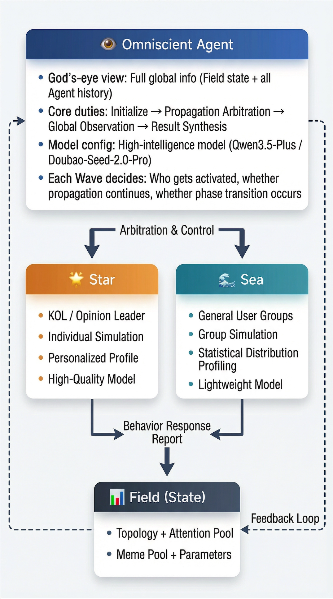

<p align="center">
  
</p>

<h1 align="center">Ripple</h1>

<p align="center">
  <strong>🌊 An Agent-Native Universal Human Social Behavior Prediction Engine Built on Complex Adaptive System (CAS) Theory</strong>
</p>

<p align="center">
  <a href="README.md">中文</a> | <a href="README_EN.md">English</a>
</p>

<p align="center">
  
  
  
  
  
  <a href="mailto:xypluslab@gmail.com"></a>
</p>

---

<details>
<summary><strong>📑 Table of Contents</strong></summary>

1. [Introduction](#-introduction)
2. [Design Philosophy](#-design-philosophy)
3. [Core Concepts: How CAS Drives Prediction](#-core-concepts-how-cas-drives-prediction)
4. [Star-Sea Architecture](#-star-sea-architecture)
5. [5-Phase Runtime Engine](#-5-phase-runtime-engine)
6. [System Architecture](#-system-architecture)
7. [Quick Start](#-quick-start)
8. [Cost Comparison](#-cost-comparison)
9. [Social Media: The First Domain Implementation](#-social-media-the-first-domain-implementation)
10. [Infinite Possibilities](#-infinite-possibilities)
11. [Project Structure](#-project-structure)
12. [Project Status](#-project-status)
13. [Tech Stack](#-tech-stack)
14. [Inspiration: OASIS](#-inspiration-oasis)
15. [Acknowledgments](#-acknowledgments)
16. [License](#-license)

</details>

---

## 🌊 Introduction

**Ripple** is an **Agent-Native universal human social behavior prediction engine** built on **Complex Adaptive System (CAS) theory**.

Information propagation in society is like ripples on water — a stone drops in, waves spread outward from the center, and when they meet other waves, they superpose, interfere, resonate, or cancel out. Ripple encodes this physical intuition into a computable engine: **signals propagate energy between agents, producing emergence, non-linear amplification, feedback loops, and phase transitions** — which is exactly how this project got its name.

**Social media content propagation simulation** is the first application scenario implemented by Ripple: input a piece of content you plan to publish, and the system outputs propagation predictions with confidence levels, system dynamics diagnostics, and actionable optimization suggestions through multi-agent simulation.

### Project Positioning

- 🔬 Independent project, inspired by the multi-agent social simulation approach of [OASIS](https://github.com/camel-ai/oasis)
- 🎯 Oriented toward practical applications (content creation, product market analysis, public opinion assessment), not academic research
- 🌐 The CAS core is completely domain-agnostic — social media is just the first application scenario
- ⚡ Pursuing ultimate practicality and cost efficiency — ~**3 orders of magnitude** reduction in LLM calls compared to OASIS

---

## 💡 Design Philosophy

### 1. 🌊 Dynamic Foundation — Ripples

Signals propagate energy through agent networks like ripples. Each agent receives a ripple and decides how to respond based on its own characteristics — amplify, absorb, mutate, or ignore — generating new ripples that continue to propagate outward. Ripples carry energy and naturally decay; when multiple ripples superpose at a node, non-linear effects may be triggered — this is the fundamental mechanism for emergent behavior in the system.

### 2. 👥 Population-Level Simulation Paradigm

Departing from OASIS's "one person = one Agent" individual simulation architecture, Ripple adopts a **population-level simulation** approach. In real social networks, most ordinary users exhibit collective statistical behavior patterns — Ripple aggregates users with similar attributes into a single population agent, replacing per-person simulation with statistical distributions, **reducing LLM calls by ~3 orders of magnitude** while preserving the ability to capture emergent behavior through the CAS theoretical framework.

### 3. ⭐🌊 Original "Star-Sea" Architecture

Ripple introduces the original **Star-Sea tri-agent architecture**:

- **🌟 Star Agents**: High-profile individuals (KOLs/opinion leaders) continue with individual simulation, retaining personalized decision-making capabilities
- **🌊 Sea Agents**: Ordinary user groups use population-level simulation, characterizing collective behavior with statistical distributions
- **👁️ Omniscient Agent**: A god's-eye-view global orchestrator, coordinating propagation arbitration, environment observation, and system regulation

The three work in concert to form an optimal resource allocation pattern of **"individual precision + population efficiency + global coordination"**.

### 4. 🤖 Agent-Native

Decision-making is **entirely delegated to LLMs**, fully leveraging LLM emergent capabilities. No hardcoded CAS parameters, no preset propagation paths — all dynamic behaviors are inferred in real-time by the Omniscient Agent based on global context. The system's intelligence comes not from predefined rules, but from LLMs' deep understanding of complex system dynamics.

### 5. ✨ Minimalist Design

System architecture is simplified as much as possible: **no third-party Agent frameworks used**, pure Python + httpx directly connecting to multiple LLM APIs. 17 core modules, ~5,300 lines of source code — pursuing the most complete CAS simulation capability with the least amount of code.

### 6. 🧩 Domain Separation & Skill Architecture

The core CAS engine is completely domain-agnostic — it knows nothing about "likes", "traffic pools", or "CES scores". All domain knowledge is injected through **Skill packages**: pure natural language domain profiles + platform profiles + role prompts, achieving **zero-code extension to new domains**.

### 7. 🔍 Intuitive & Traceable

The entire simulation process is fully observable: every Wave's Omniscient arbitration, every agent's response decision, ripple propagation paths and energy changes — all incrementally recorded as structured JSON. Prediction results come with **confidence assessments**, letting users clearly know how "certain" or "uncertain" the model is.

---

## 🔬 Core Concepts: How CAS Drives Prediction

Human social behavior inherently exhibits the core characteristics of **Complex Adaptive Systems (CAS)**. Ripple encodes these characteristics as the engine's core primitives:

| CAS Characteristic | Meaning | Implementation in Ripple | Real-World Examples |
|-------------------|---------|------------------------|-------------------|
| **Emergence** | Macro behaviors spontaneously arise from micro interactions | Omniscient observation + emergence detection | Viral propagation, market bubbles, social movements |
| **Non-linearity** | Small perturbations can trigger massive effects | Ripple energy propagation + superposition effects | One repost triggers a cascade, technology adoption S-curve |
| **Positive Feedback** | Self-reinforcing growth cycles | Omniscient dynamic propagation arbitration | High engagement → algorithmic recommendation → more exposure |
| **Negative Feedback** | Self-suppressing braking mechanisms | Energy decay + attention competition | Content fatigue, aesthetic saturation, market saturation |
| **Phase Transition** | System abruptly shifts between macro states | PhaseVector multi-dimensional phase tracking | Content propagation "tipping point", opinion reversal |
| **Sensitivity to Initial Conditions** | Small initial differences lead to vastly different outcomes | Seed user differentiated responses | First users determine product diffusion path |
| **Adaptation** | Agents adjust behavior based on environmental changes | Star/Sea context-based LLM decisions | Users follow trends, avoid negative topics |

### Ripple Core Primitives

| Primitive | Definition | Role in Engine |
|-----------|-----------|---------------|
| **Ripple** | Basic unit of information propagation | Carries content, energy, sentiment, propagation path; supports semantic mutation |
| **Event** | Agent behavior record | Records action type, energy transformation, response method |
| **Field** | CAS global environment state | Maintains topology, attention pool, meme pool, dynamic parameters |
| **PhaseVector** | Multi-dimensional representation of system macro state | Tracks heat, sentiment polarization, topic convergence/divergence, etc. |
| **Meme** | Cultural information propagation unit | Evolves in the meme pool, influences propagation dynamics |

---

## ⭐ Star-Sea Architecture

The tri-agent architecture of Ripple is key to understanding the entire system:

<p align="center">
  
</p>

| Agent | Maps To | Simulation Granularity | LLM Model | Responsibilities |
|-------|---------|----------------------|-----------|-----------------|
| **👁️ Omniscient** | The system itself | Global | High-intelligence (Qwen3.5-Plus / Doubao-Seed-2.0-Pro) | Initialization, propagation arbitration, observation, synthesis |
| **🌟 Star** | KOL / Opinion leaders | Individual | High-quality (Doubao-Seed-2.0-Lite / DeepSeek-V3.2) | Personalized content decisions, influence propagation |
| **🌊 Sea** | Ordinary user groups | Population | Lightweight (Doubao-Seed-2.0-Mini / Qwen3-Flash) | Statistical population response, interaction behavior |

---

## 🔄 5-Phase Runtime Engine

The Omniscient-driven 5-Phase Wave execution cycle:

```
Phase 0        Phase 1         Phase 2          Phase 3           Phase 4
 INIT    ──▶    SEED    ──▶    RIPPLE    ──▶    OBSERVE    ──▶    FEEDBACK
                                                                  & RECORD
 Omniscient     Omniscient     Star/Sea         Omniscient         Engine
 Init scenario  Seed ripples   Respond &        Global observation Record & loop
 Build topology Determine      propagate        Phase detection    decision
 Estimate waves  seeds         Energy decay     Emergence detect   ──▶ Next Wave
                Activate agents Semantic mut.                          or terminate
```

### Phase Details

| Phase | Name | Driver | Core Actions |
|-------|------|--------|-------------|
| **Phase 0** | INIT | Omniscient | Parse input, build agent topology, initialize Field, estimate total Wave count |
| **Phase 1** | SEED | Omniscient | Create seed Ripples, determine initial energy and propagation targets |
| **Phase 2** | RIPPLE | Star & Sea | Activated agents receive ripples and decide responses (amplify/absorb/mutate/ignore) |
| **Phase 3** | OBSERVE | Omniscient | Aggregate macro metrics, observe system state, determine phase changes |
| **Phase 4** | FEEDBACK & RECORD | Engine | Record Wave data, update Field state, determine termination or proceed to next round |

---

## 🏗️ System Architecture

<p align="center">
  
</p>

**Dependency direction** (strictly unidirectional): Application Layer → Skill Layer → CAS Engine → LLM Adapter Layer

---

## 🚀 Quick Start

### Requirements

- Python 3.11+
- pip

### Installation

```bash
# Clone the repository
git clone https://github.com/your-org/Ripple.git
cd Ripple

# Install core dependencies
pip install -e .

# Install development dependencies (including tests)
pip install -e ".[dev]"

# For AWS Bedrock support
pip install -e ".[bedrock]"
```

### Configure LLM

```bash
# Copy the configuration template
cp llm_config.example.yaml llm_config.yaml

# Edit the config file and fill in your API Keys
# Supports Anthropic / OpenAI (including compatible protocols) / AWS Bedrock / Volcengine, etc.
```

### Three-Tier Model Recommendations

Ripple's tri-agent system has different LLM capability requirements. The following three-tier model selection is recommended (when cost is not a concern, all agents can use the high-intelligence tier for better simulation results):

| Tier | Target Role | Recommended Models | Description |
|------|------------|-------------------|-------------|
| 🧠 **High-Intelligence** | Omniscient | Qwen3.5-Plus / Doubao-Seed-2.0-Pro | Requires deep reasoning and global decision-making, responsible for CAS global orchestration |
| ⚡ **High-Quality** | Star Agent | Doubao-Seed-2.0-Lite / DeepSeek-V3.2 | Balances quality and speed, responsible for KOL personalized decisions |
| 🪶 **Lightweight** | Sea Agent | Doubao-Seed-2.0-Mini / Qwen3-Flash | Low latency, high concurrency, responsible for population behavior statistical simulation |

> 💡 The above are Chinese LLM recommendations. Also supports Anthropic (Claude Opus/Sonnet/Haiku), OpenAI (GPT-5.2) and other international models. See `llm_config.example.yaml` for details.

Configuration example (Volcengine · Doubao Seed 2.0 series):

```yaml
_default:
  model_platform: openai
  model_name: doubao-seed-2-0-lite-260215      # Global default: balanced
  api_key: ${ARK_API_KEY}
  url: https://ark.cn-beijing.volces.com/api/v3
  api_mode: chat_completions
  temperature: 0.7

omniscient:
  model_name: doubao-seed-2-0-pro-260215       # Omniscient: flagship high-intelligence
  temperature: 0.7

star:
  model_name: doubao-seed-2-0-lite-260215      # Star: balanced high-quality
  temperature: 0.8

sea:
  model_name: doubao-seed-2-0-mini-260215      # Sea: lightweight high-concurrency
  temperature: 0.5
```

Configuration example (Alibaba Cloud · Qwen series):

```yaml
_default:
  model_platform: openai
  model_name: qwen3-max                        # Global default: flagship
  api_key: ${DASHSCOPE_API_KEY}
  url: https://dashscope.aliyuncs.com/compatible-mode/v1
  api_mode: chat_completions
  temperature: 0.7

omniscient:
  model_name: qwen3.5-plus                     # Omniscient: latest flagship high-intelligence
  temperature: 0.7

star:
  model_name: qwen3-max                        # Star: high-quality
  temperature: 0.8

sea:
  model_name: qwen-turbo                       # Sea: lightweight fast
  temperature: 0.5
```

### Basic Usage

```python
import asyncio
from ripple.api.simulate import simulate

async def main():
    result = await simulate(
        event={
            "title": "Amazing Foundation Review | Holy Grail for Dry Skin!",
            "content_type": "photo_note",
            "tags": ["beauty", "foundation", "review", "dry_skin"],
            "tone": "genuine_recommendation",
            "description": "Sharing a foundation perfect for dry skin, 12-hour wear test",
        },
        skill="social-media",
        platform="xiaohongshu",
        simulation_horizon="48h",       # Simulate 48 hours after posting
    )

    print(f"Simulation complete! Results saved to: {result['output_file']}")

asyncio.run(main())
```

### Switch Platforms

Simply change the `platform` parameter to switch between social media platforms:

```python
# Xiaohongshu (RED)
await simulate(event=event, skill="social-media", platform="xiaohongshu")

# Douyin (TikTok China)
await simulate(event=event, skill="social-media", platform="douyin")

# Weibo / Bilibili / Zhihu / WeChat Official Account / Generic
# platform="weibo" / "bilibili" / "zhihu" / "wechat" / "generic"
```

### Run Tests

```bash
# All tests
pytest

# Verbose output
pytest -v
```

---

## 📊 Cost Comparison

|  | OASIS (Per-Person Simulation) | **Ripple (CAS Population-Level Simulation)** |
|--|-------------------------------|---------------------------------------------|
| Theoretical Paradigm | Multi-agent simulation | **Complex Adaptive System (CAS)** |
| Simulation Granularity | One user = one Agent | **One population = one Agent** |
| LLM Calls / Simulation | ~300,000 | **~20–50** (typical scenarios) |
| Runtime | Hours | **Minutes** |
| Prediction Output | Deterministic single values | **Predictions with confidence + dynamics diagnostics + optimization suggestions** |
| Cross-Group Interaction | Yes (per-person level) | **Yes (emergent, population-level)** |
| Feedback Modeling | Yes (per-person level) | **Yes (positive/negative feedback + phase transitions)** |
| Domain Generality | Social media | **Any human social behavior** |
| Agent Framework | CAMEL-AI | **Native Python (no framework dependency)** |
| Platform Adaptation | Code-level implementation | **Pure natural language profile driven (zero-code)** |
| vs OASIS Compression | — | **~3 orders of magnitude** |

---

## 📱 Social Media: The First Domain Implementation

Social media content propagation is the **first application scenario** of the CAS engine. Through the `social-media` Skill, CAS primitives are mapped to concrete social media concepts:

| CAS Primitive | Social Media Concept | Description |
|--------------|---------------------|-------------|
| Ripple | Content propagation wave | The spread and diffusion process of posts/videos |
| Star Agent | KOL / Influencer | High-follower opinion leaders with personalized decision-making |
| Sea Agent | Audience groups | e.g., "young women - beauty interest", "25-35 age - parenting group" |
| Field | Platform environment | Recommendation algorithms, attention allocation, competing content pool |
| Event | Interaction behavior | Like / Save / Comment / Share / Follow / Ignore |
| PhaseVector | Propagation phase | Seed → Growth → Explosion → Decline |

### 7 Platforms Supported

| Platform | Identifier | Profile File |
|----------|-----------|-------------|
| 🔴 Xiaohongshu (RED) | `xiaohongshu` | [`platforms/xiaohongshu.md`](skills/social-media/platforms/xiaohongshu.md) |
| 🎵 Douyin (TikTok CN) | `douyin` | [`platforms/douyin.md`](skills/social-media/platforms/douyin.md) |
| 🔥 Weibo | `weibo` | [`platforms/weibo.md`](skills/social-media/platforms/weibo.md) |
| 📺 Bilibili | `bilibili` | [`platforms/bilibili.md`](skills/social-media/platforms/bilibili.md) |
| 💡 Zhihu | `zhihu` | [`platforms/zhihu.md`](skills/social-media/platforms/zhihu.md) |
| 💬 WeChat Official Account | `wechat` | [`platforms/wechat.md`](skills/social-media/platforms/wechat.md) |
| 🌐 Generic Platform | `generic` | [`platforms/generic.md`](skills/social-media/platforms/generic.md) |

Each platform describes its user ecosystem, recommendation algorithms, and interaction characteristics through pure natural language profile files — **zero-code extension to new platforms**.

---

## 🔮 Infinite Possibilities

Social media is just the beginning. The same CAS engine can be extended to any human social behavior prediction domain by writing new Skill packages — without modifying a single line of core code:

| Application | Core Question | Agent Mapping | Ripple Mapping |
|------------|--------------|--------------|---------------|
| 🛍️ **Product Market Prediction** | Which product design will resonate more with consumers? | Consumer groups | Product experience / word-of-mouth propagation |
| 🤝 **Service Acceptance** | How will customers perceive a new service? | Customer groups | Service experience / review diffusion |
| 📈 **Capital Market Reaction** | How will investors react to an upcoming announcement? | Investor groups | Announcement signals / market sentiment conduction |
| 📰 **Public Opinion Prediction** | How will public opinion evolve? What strategies can influence the trajectory? | Social groups | Topic events / opinion propagation |
| 🏢 **Organizational Change** | How will employee acceptance evolve after implementing a new policy? | Departments / Teams | Policy signals / attitude propagation |
| 🗳️ **Public Decision-Making** | How will the community react to new plans? | Resident groups | Plan announcement / opinion propagation |

**Extension method**: Create a new Skill directory under `skills/`, write domain profiles (domain-profile.md) and role prompts (prompts/*.md) — no engine code modification needed.

---

## 📁 Project Structure

```
ripple/
├── engine/                 # 🔬 5-Phase runtime orchestration
│   ├── runtime.py          #   SimulationRuntime — core orchestration engine
│   └── recorder.py         #   SimulationRecorder — incremental JSON recorder
├── agents/                 # 🤖 Tri-agent system
│   ├── omniscient.py       #   👁️ Omniscient — global decision center
│   ├── star.py             #   🌟 Star — KOL individual decisions
│   └── sea.py              #   🌊 Sea — population behavior simulation
├── primitives/             # 📐 CAS core data models
│   ├── models.py           #   Ripple / Event / Field / PhaseVector / Meme
│   └── events.py           #   SimulationEvent (progress callback events)
├── skills/                 # 🧩 Skill discovery & loading
│   ├── manager.py          #   SkillManager — multi-path search & loading
│   └── validator.py        #   Skill format validation
├── llm/                    # 🔌 LLM multi-backend adapters
│   ├── chat_completions_adapter.py   # OpenAI Chat Completions protocol
│   ├── responses_adapter.py          # OpenAI Responses API protocol
│   ├── anthropic_adapter.py          # Anthropic Messages API native
│   ├── bedrock_adapter.py            # AWS Bedrock (boto3 + SigV4)
│   ├── router.py                     # Model routing + budget control + fallback
│   └── config.py                     # Config loading (YAML + env vars)
├── api/                    # 🚀 Public API
│   └── simulate.py         #   simulate() — one-click simulation entry point
└── prompts.py              # 📝 System prompt templates

skills/
└── social-media/           # 📱 Social Media Skill (first domain implementation)
    ├── SKILL.md            #   Skill metadata
    ├── domain-profile.md   #   Domain profile (general social media knowledge)
    ├── platforms/           #   7 platform profile files
    │   ├── xiaohongshu.md  #     🔴 Xiaohongshu (RED)
    │   ├── douyin.md       #     🎵 Douyin (TikTok CN)
    │   ├── weibo.md        #     🔥 Weibo
    │   ├── bilibili.md     #     📺 Bilibili
    │   ├── zhihu.md        #     💡 Zhihu
    │   ├── wechat.md       #     💬 WeChat Official Account
    │   └── generic.md      #     🌐 Generic platform
    └── prompts/             #   Role prompt templates
        ├── omniscient.md   #     Omniscient prompt
        ├── star.md         #     Star agent prompt
        └── sea.md          #     Sea agent prompt

tests/                       # ✅ Test suite (148 cases, all passing)
├── agents/                 #   Agent tests
├── api/                    #   API tests
├── engine/                 #   Engine tests
├── integration/            #   Integration tests (end-to-end)
├── llm/                    #   LLM adapter tests
├── primitives/             #   Primitive tests
└── skills/                 #   Skill loading tests

examples/                    # 📖 Examples
└── e2e_simulation_xiaohongshu.py  # Xiaohongshu full simulation example
```

---

## 📋 Project Status

> **v0.1.0 — Core architecture implemented, iterating continuously** 🚧

| Metric | Data |
|--------|------|
| Version | `0.1.0` |
| Core source files | 17 modules |
| Lines of code | ~5,300 (excluding tests and `__init__`) |
| Test cases | 148 (all passing ✅, < 0.1s) |
| Test files | 13 (covering all layers) |
| Supported platforms | 7 (Xiaohongshu · Douyin · Weibo · Bilibili · Zhihu · WeChat · Generic) |
| LLM backends | Anthropic · OpenAI (including compatible protocols) · AWS Bedrock |
| LLM protocols | Chat Completions · Responses API · Anthropic Messages · Bedrock |
| Python | ≥ 3.11 |

---

## 🛠️ Tech Stack

| Component | Choice | Rationale |
|-----------|--------|-----------|
| Language | Python 3.11+ | Rich ecosystem, excellent LLM API support |
| Async | asyncio | Multi-agent parallel invocation |
| LLM Communication | httpx | Native HTTP client, zero framework dependency, direct multi-provider API connection |
| Data Models | Pydantic dataclasses | Strong type validation, JSON serialization |
| Configuration | PyYAML + python-dotenv | YAML config files + environment variable injection |
| Output Format | JSON | Lightweight, readable, no external database dependency |
| Testing | pytest + pytest-asyncio | Standard async testing solution |
| Agent Framework | **None** | Minimalist design, pure native Python implementation |

---

## 🏛️ Inspiration: OASIS

<p>
  <a href="https://github.com/camel-ai/oasis">
    
  </a>
  
</p>

Ripple's core inspiration comes from [OASIS](https://github.com/camel-ai/oasis) (Open Agent Social Interaction Simulations) — a scalable social media simulator by the [CAMEL-AI](https://www.camel-ai.org/) open-source community, capable of realistically simulating up to **one million users'** behavior on social platforms using LLM agents.

### Ripple vs. OASIS

Ripple is a **completely independent project** that draws on OASIS's core idea of "agents interacting with platform environments", but with a comprehensive redesign in architecture and paradigm:

| Dimension | OASIS | Ripple |
|-----------|-------|--------|
| **Theoretical Paradigm** | Multi-agent simulation | Complex Adaptive System (CAS) |
| **Simulation Granularity** | One user = one Agent | One population = one Agent |
| **Domain Scope** | Social media | Any human social behavior |
| **Prediction Output** | Deterministic | Probabilistic predictions with confidence |
| **LLM Call Volume** | O(N), scales linearly with user count | O(K), depends only on number of populations |
| **Emergence Capture** | Natural emergence via per-person interaction | CAS theory-driven + LLM dynamic inference |
| **Agent Framework** | CAMEL-AI | Native Python (no framework dependency) |
| **Platform Adaptation** | Code-level implementation | Pure natural language profile driven (zero-code extension) |

Ripple transforms OASIS's "precise per-person simulation" approach into "CAS theory-driven population-level intelligent inference", maintaining a ~**3 orders of magnitude** cost advantage while gaining emergent behavior capture capability through the CAS theoretical framework, and extending applicability from social media to universal human social behavior prediction.

---

## 🙏 Acknowledgments

The birth of Ripple would not have been possible without the inspiration and support of the following outstanding open-source projects. We extend our heartfelt gratitude:

- **[OASIS](https://github.com/camel-ai/oasis)** — Thanks to the CAMEL-AI open-source community for the OASIS social media simulation engine. OASIS's pioneering approach of "using LLM agents to simulate social media user behavior" was the core inspiration for the Ripple project. Building upon this, Ripple explores a CAS theory-driven population-level simulation paradigm, bringing large-scale social simulation from research scenarios into practical applications and extending it to universal human social behavior prediction. [[Paper]](https://arxiv.org/abs/2411.11581)

- **[CAMEL](https://github.com/camel-ai/camel)** — Thanks to the CAMEL-AI open-source community for the CAMEL multi-agent framework. CAMEL was the first LLM multi-agent framework (NeurIPS 2023), and its exploration of agent design and multi-agent collaboration laid the foundation for the entire field, profoundly influencing Ripple's architectural thinking. [[Paper]](https://arxiv.org/abs/2303.17760)

### Citation

If you use Ripple in academic research, please also cite the OASIS and CAMEL projects:

```bibtex
@misc{yang2024oasis,
  title={OASIS: Open Agent Social Interaction Simulations with One Million Agents},
  author={Ziyi Yang and Zaibin Zhang and Zirui Zheng and Yuxian Jiang and Ziyue Gan and Zhiyu Wang and Zijian Ling and Jinsong Chen and Martz Ma and Bowen Dong and Prateek Gupta and Shuyue Hu and Zhenfei Yin and Guohao Li and Xu Jia and Lijun Wang and Bernard Ghanem and Huchuan Lu and Chaochao Lu and Wanli Ouyang and Yu Qiao and Philip Torr and Jing Shao},
  year={2024},
  eprint={2411.11581},
  archivePrefix={arXiv},
  primaryClass={cs.CL}
}

@inproceedings{li2023camel,
  title={CAMEL: Communicative Agents for "Mind" Exploration of Large Language Model Society},
  author={Li, Guohao and Hammoud, Hasan Abed Al Kader and Itani, Hani and Khizbullin, Dmitrii and Ghanem, Bernard},
  booktitle={Thirty-seventh Conference on Neural Information Processing Systems},
  year={2023}
}
```

---

## 📜 License

[GNU Affero General Public License v3.0 (AGPL-3.0)](LICENSE)
