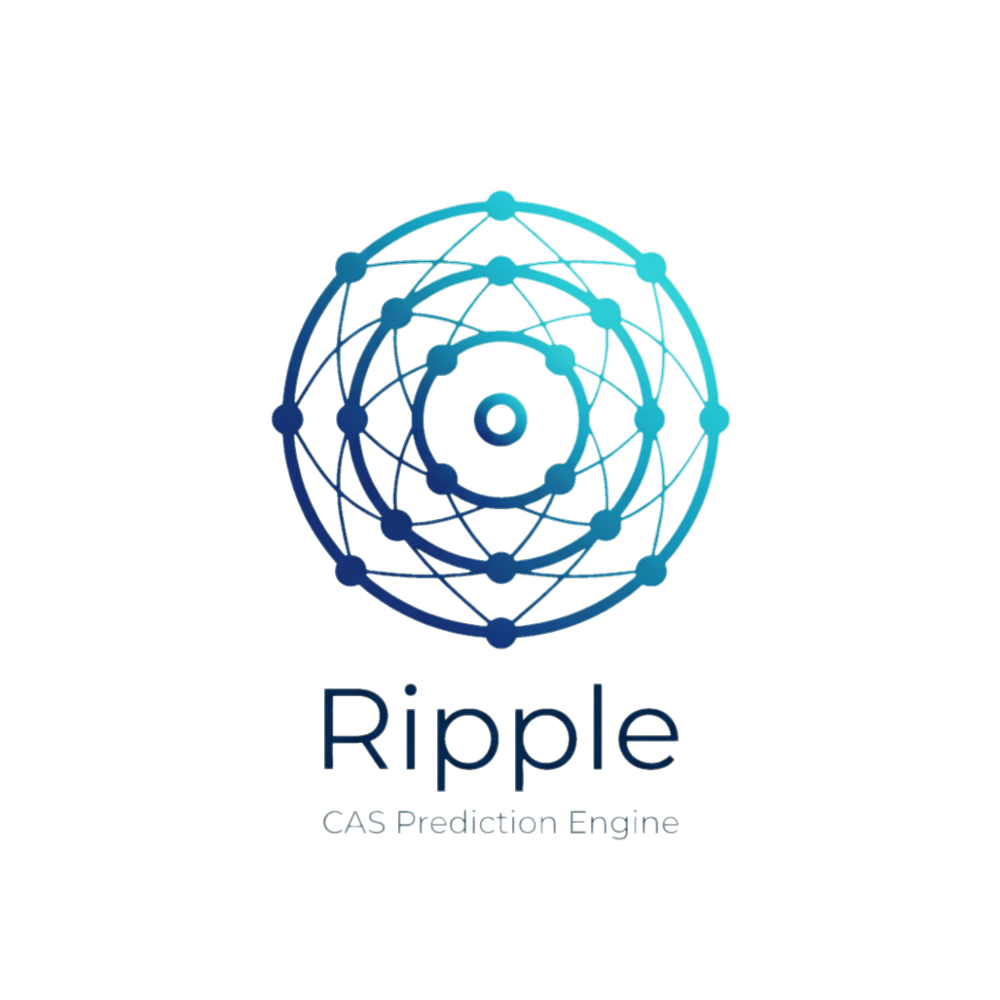

<p align="center">
  
</p>

<h1 align="center">Ripple</h1>

<p align="center">
  <strong>🌊 An Agent-Native Universal Human Social Behavior Prediction Engine Built on Complex Adaptive System (CAS) Theory</strong>
</p>

<p align="center">
  <a href="README.md">中文</a> | <a href="README_EN.md">English</a>
</p>

<p align="center">
  <a href="https://x.com/_xyplus_"></a>
  <a href="mailto:xypluslab@gmail.com"></a>
</p>

<p align="center">
  
  
  
  
  
  
</p>

---

<details>
<summary><strong>📑 Table of Contents</strong></summary>

1. [Introduction](#-introduction)
2. [Design Philosophy](#-design-philosophy)
3. [Core Concepts: How CAS Drives Prediction](#-core-concepts-how-cas-drives-prediction)
4. [Star-Sea-Tribunal Architecture](#-star-sea-tribunal-architecture)
5. [Runtime Engine](#-runtime-engine)
6. [System Architecture](#-system-architecture)
7. [Quick Start](#-quick-start)
8. [Cost Comparison](#-cost-comparison)
9. [Social Media: The First Domain Implementation](#-social-media-the-first-domain-implementation)
10. [PMF Validation: The Second Domain Implementation](#-pmf-validation-the-second-domain-implementation)
11. [Infinite Possibilities](#-infinite-possibilities)
12. [Project Structure](#-project-structure)
13. [Project Status](#-project-status)
14. [Tech Stack](#-tech-stack)
15. [Document Index](#-document-index)
16. [Inspiration: OASIS](#-inspiration-oasis)
17. [Acknowledgments](#-acknowledgments)
18. [License](#-license)

</details>

---

## 🌊 Introduction

**Ripple** is an **Agent-Native universal human social behavior prediction engine** built on **Complex Adaptive System (CAS) theory**.

Information propagation in society is like ripples on water — a stone drops in, waves spread outward from the center, and when they meet other waves, they superpose, interfere, resonate, or cancel out. Ripple encodes this physical intuition into a computable engine: **signals propagate energy between agents, producing emergence, non-linear amplification, feedback loops, and phase transitions** — which is exactly how this project got its name.

Ripple currently implements **two application scenarios**:

- **📱 Social Media Content Propagation Prediction**: Input a piece of content you plan to publish, and the system outputs propagation predictions with confidence levels, system dynamics diagnostics, and actionable optimization suggestions through multi-agent simulation
- **🎯 PMF (Product-Market Fit) Validation**: Input a product plan and target market, and the system simulates real consumer group reactions, outputting multi-dimensional PMF scores, risk diagnostics, and improvement strategies

Both scenarios incorporate the **Tribunal mechanism** — through multi-expert structured debate, systematically countering LLM optimism bias to ensure prediction realism.

### Project Positioning

- 🔬 Independent project, inspired by the multi-agent social simulation approach of [OASIS](https://github.com/camel-ai/oasis)
- 🎯 Oriented toward practical applications (content creation, product market analysis, public opinion assessment), not academic research
- 🌐 The CAS core is completely domain-agnostic — social media and PMF validation are the first two application scenarios
- ⚡ Pursuing ultimate practicality and cost efficiency — ~**3 orders of magnitude** reduction in LLM calls compared to OASIS

---

## 💡 Design Philosophy

### 1. 🌊 Dynamic Foundation — Ripples

Signals propagate energy through agent networks like ripples. Each agent receives a ripple and decides how to respond based on its own characteristics — amplify, absorb, mutate, or ignore — generating new ripples that continue to propagate outward. Ripples carry energy and naturally decay; when multiple ripples superpose at a node, non-linear effects may be triggered — this is the fundamental mechanism for emergent behavior in the system.

### 2. 👥 Population-Level Simulation Paradigm

Departing from OASIS's "one person = one Agent" individual simulation architecture, Ripple adopts a **population-level simulation** approach. In real social networks, most ordinary users exhibit collective statistical behavior patterns — Ripple aggregates users with similar attributes into a single population agent, replacing per-person simulation with statistical distributions, **reducing LLM calls by ~3 orders of magnitude** while preserving the ability to capture emergent behavior through the CAS theoretical framework.

### 3. ⭐🌊 Original "Star-Sea-Tribunal" Architecture

Ripple introduces the original **Star-Sea-Tribunal quad-agent architecture**:

- **🌟 Star Agents**: High-profile individuals (KOLs/opinion leaders) continue with individual simulation, retaining personalized decision-making capabilities
- **🌊 Sea Agents**: Ordinary user groups use population-level simulation, characterizing collective behavior with statistical distributions
- **👁️ Omniscient Agent**: A god's-eye-view global orchestrator, coordinating propagation arbitration, environment observation, and system regulation
- **⚖️ Tribunal Agents**: Multi-expert review panel, calibrating prediction results through structured debate

The four work in concert to form an optimal resource allocation pattern of **"individual precision + population efficiency + global coordination + multi-perspective calibration"**.

### 4. 🤖 Agent-Native

Decision-making is **entirely delegated to LLMs**, fully leveraging LLM emergent capabilities. No hardcoded CAS parameters, no preset propagation paths — all dynamic behaviors are inferred in real-time by the Omniscient Agent based on global context. The system's intelligence comes not from predefined rules, but from LLMs' deep understanding of complex system dynamics.

### 5. ✨ Minimalist Design

System architecture is simplified as much as possible: **no third-party Agent frameworks used**, pure Python + httpx directly connecting to multiple LLM APIs. 23 core modules — pursuing the most complete CAS simulation capability with the least amount of code.

### 6. 🧩 Domain Separation & Skill Architecture

The core CAS engine is completely domain-agnostic — it knows nothing about "likes", "traffic pools", or "PMF scores". All domain knowledge is injected through **Skill packages**: pure natural language domain profiles + platform/channel/vertical profiles + role prompts, achieving **zero-code extension to new domains**.

### 7. ⚖️ Tribunal Calibration Mechanism

The **Tribunal** multi-expert review architecture is introduced, with a structured debate process — **independent review → cross-challenge → revise positions → synthesize verdict** — systematically countering LLM optimism bias. Tribunals across different domains are configured with different expert roles, scoring dimensions, and review criteria, while sharing the same debate mechanism. Combined with the **five-layer anti-optimism-bias defense** (industry reality anchors → conservative instructions → realistic behavior anchoring → optimism audit → behavioral anchor calibration), prediction results are kept grounded in reality.

### 8. 🔍 Intuitive & Traceable

The entire simulation process is fully observable: every Wave's Omniscient arbitration, every agent's response decision, ripple propagation paths and energy changes, the Tribunal's review process and debate records — all incrementally recorded as structured JSON. Prediction results come with **confidence assessments**, letting users clearly know how "certain" or "uncertain" the model is.

---

## 🔬 Core Concepts: How CAS Drives Prediction

Human social behavior inherently exhibits the core characteristics of **Complex Adaptive Systems (CAS)**. Ripple encodes these characteristics as the engine's core primitives:

| CAS Characteristic | Meaning | Implementation in Ripple | Real-World Examples |
|-------------------|---------|------------------------|-------------------|
| **Emergence** | Macro behaviors spontaneously arise from micro interactions | Omniscient observation + emergence detection | Viral propagation, market bubbles, social movements |
| **Non-linearity** | Small perturbations can trigger massive effects | Ripple energy propagation + superposition effects | One repost triggers a cascade, technology adoption S-curve |
| **Positive Feedback** | Self-reinforcing growth cycles | Omniscient dynamic propagation arbitration | High engagement → algorithmic recommendation → more exposure |
| **Negative Feedback** | Self-suppressing braking mechanisms | Energy decay + attention competition | Content fatigue, aesthetic saturation, market saturation |
| **Phase Transition** | System abruptly shifts between macro states | PhaseVector multi-dimensional phase tracking | Content propagation "tipping point", opinion reversal |
| **Sensitivity to Initial Conditions** | Small initial differences lead to vastly different outcomes | Seed user differentiated responses | First users determine product diffusion path |
| **Adaptation** | Agents adjust behavior based on environmental changes | Star/Sea context-based LLM decisions | Users follow trends, avoid negative topics |

### Ripple Core Primitives

| Primitive | Definition | Role in Engine |
|-----------|-----------|---------------|
| **Ripple** | Basic unit of information propagation | Carries content, energy, sentiment, propagation path; supports semantic mutation |
| **Event** | Agent behavior record | Records action type, energy transformation, response method |
| **Field** | CAS global environment state | Maintains topology, attention pool, meme pool, dynamic parameters |
| **PhaseVector** | Multi-dimensional representation of system macro state | Tracks heat, sentiment polarization, topic convergence/divergence, etc. |
| **Meme** | Cultural information propagation unit | Evolves in the meme pool, influences propagation dynamics |

---

## ⭐ Star-Sea-Tribunal Architecture

Ripple's quad-agent architecture is key to understanding the entire system:

<p align="center">
  
</p>

| Agent | Maps To | Granularity | LLM Model | Responsibilities |
|-------|---------|-------------|-----------|-----------------|
| **👁️ Omniscient** | The system itself | Global | High-intelligence (Qwen3.5-Plus / Doubao-Seed-2.0-Pro) | Initialization, propagation arbitration, observation, Tribunal moderation, final synthesis |
| **🌟 Star** | KOL / Opinion leaders | Individual | High-quality (Doubao-Seed-2.0-Lite / DeepSeek-V3.2) | Personalized content decisions, influence propagation |
| **🌊 Sea** | Ordinary user groups | Population | Lightweight (Doubao-Seed-2.0-Mini / Qwen3-Flash) | Statistical population response, interaction behavior |
| **⚖️ Tribunal** | Domain expert panel | Global | High-intelligence (same tier as Omniscient) | Multi-dimensional review, cross-challenge, anti-optimism calibration |

### Tribunal Role Configuration Across Domains

The Tribunal's core mechanism (evaluate → challenge → revise → synthesize) is domain-agnostic, but expert roles and scoring dimensions vary by domain:

| Dimension | Social Media Tribunal | PMF Validation Tribunal |
|-----------|----------------------|------------------------|
| **Mission** | Propagation prediction realism calibration | Multi-dimensional product-market fit scoring |
| **Members** | Propagation dynamics expert · Platform ecosystem expert · Devil's advocate | Market analyst · User advocate · Devil's advocate |
| **Score semantics** | High score = prediction is reasonable with strong evidence | High score = strong PMF signal |
| **Score of 3** | Simulation prediction matches baseline reality | Product performs averagely on this dimension |
| **Core focus** | Whether propagation predictions are overly optimistic | Whether product demand is real |

---

## 🔄 Runtime Engine

The Omniscient-driven 5-Phase Wave execution cycle, with an optional DELIBERATE Tribunal review phase:

<p align="center">
  
</p>

### Phase Details

| Phase | Name | Driver | Core Actions |
|-------|------|--------|-------------|
| **Phase 0** | INIT | Omniscient | Parse input, build agent topology, initialize Field, estimate total Wave count |
| **Phase 1** | SEED | Omniscient | Create seed Ripples, determine initial energy and propagation targets |
| **Phase 2** | RIPPLE | Star & Sea | Activated agents receive ripples and decide responses (amplify/absorb/mutate/ignore) |
| **Phase 3** | OBSERVE | Omniscient | Aggregate macro metrics, observe system state, determine phase changes |
| **Phase 4** | FEEDBACK & RECORD | Engine | Record Wave data, update Field state, determine termination or proceed to next round |
| **Extra** | DELIBERATE | Omniscient + Tribunal | Multi-expert review, structured debate, anti-optimism calibration, synthesize final verdict |

---

## 🏗️ System Architecture

<p align="center">
  
</p>

---

## 🚀 Quick Start

### Recommended: Docker Startup (Docker only)

No local Python/pip dependencies are required. The service is exposed via HTTP+SSE.

`RIPPLE_API_TOKEN` is optional:

- If it is unset, empty, or only whitespace, all service endpoints skip authentication
- If it is set to a non-empty value, all service endpoints require `Authorization: Bearer <token>`

`deploy/docker/docker-compose.yml` now defaults to **auth disabled** as well; authentication is only enabled when you explicitly set `RIPPLE_API_TOKEN`.

#### Mode 1: Pass Default LLM at Startup (auth enabled explicitly)

After startup, `POST /v1/simulations` can omit `llm_config`.

**A) Hardcode API Key (plaintext)**

```bash
docker run -d --name ripple-service \
  -p 127.0.0.1:8080:8080 \
  -e RIPPLE_API_TOKEN=your-service-token \
  -e RIPPLE_LLM_MODEL_PLATFORM=openai \
  -e RIPPLE_LLM_MODEL_NAME=gpt-5.2 \
  -e RIPPLE_LLM_API_KEY=sk-xxx \
  -e RIPPLE_LLM_URL=https://api.openai.com/v1 \
  -e RIPPLE_LLM_API_MODE=chat_completions \
  -v ripple-service-data:/data \
  xyplusxy/ripple:v0.2.0
```

**B) Reference Host Environment Variable**

```bash
export OPENAI_API_KEY=sk-xxx

docker run -d --name ripple-service \
  -p 127.0.0.1:8080:8080 \
  -e RIPPLE_API_TOKEN=your-service-token \
  -e RIPPLE_LLM_MODEL_PLATFORM=openai \
  -e RIPPLE_LLM_MODEL_NAME=gpt-5.2 \
  -e RIPPLE_LLM_API_KEY="$OPENAI_API_KEY" \
  -e RIPPLE_LLM_URL=https://api.openai.com/v1 \
  -e RIPPLE_LLM_API_MODE=chat_completions \
  -v ripple-service-data:/data \
  xyplusxy/ripple:v0.2.0
```

**Mode 1: HTTP+SSE Call Sample (auth enabled)**

```bash
BASE_URL=http://127.0.0.1:8080
RIPPLE_API_TOKEN=your-service-token

# 1) Create job
curl -sS -X POST "$BASE_URL/v1/simulations" \
  -H "Authorization: Bearer $RIPPLE_API_TOKEN" \
  -H "Content-Type: application/json" \
  -d '{
    "skill":"pmf-validation",
    "event":{"name":"demo","description":"startup default llm"}
  }'

# 2) Stream events (SSE)
curl -N "$BASE_URL/v1/simulations/<JOB_ID>/events" \
  -H "Authorization: Bearer $RIPPLE_API_TOKEN"

# 3) Get status
curl -sS "$BASE_URL/v1/simulations/<JOB_ID>" \
  -H "Authorization: Bearer $RIPPLE_API_TOKEN"
```

#### Mode 2: No LLM at Startup (pass `llm_config` per request, auth disabled by default)

```bash
docker run -d --name ripple-service \
  -p 127.0.0.1:8080:8080 \
  -v ripple-service-data:/data \
  xyplusxy/ripple:v0.2.0
```

> If you want this mode to require auth too, add `-e RIPPLE_API_TOKEN=your-service-token`.

**Mode 2: HTTP+SSE Call Sample (no auth)**

```bash
BASE_URL=http://127.0.0.1:8080

# 1) Create job (pass llm_config in request)
curl -sS -X POST "$BASE_URL/v1/simulations" \
  -H "Content-Type: application/json" \
  -d '{
    "skill":"pmf-validation",
    "event":{"name":"demo","description":"api-level llm config"},
    "llm_config":{
      "_default":{
        "model_platform":"openai",
        "model_name":"gpt-5.2",
        "api_key":"sk-xxx",
        "url":"https://api.openai.com/v1",
        "api_mode":"chat_completions"
      }
    }
  }'

# 2) Stream events (SSE)
curl -N "$BASE_URL/v1/simulations/<JOB_ID>/events"

# 3) Get status
curl -sS "$BASE_URL/v1/simulations/<JOB_ID>"
```

### Manual Installation (Non-Docker)

#### Requirements

- Python 3.11+
- pip

#### Installation

```bash
# Clone the repository
git clone https://github.com/xyskywalker/Ripple.git
cd Ripple

# Install core dependencies
pip install -e .

# Install development dependencies (including tests)
pip install -e ".[dev]"

# For AWS Bedrock support
pip install -e ".[bedrock]"
```

#### Configure LLM

```bash
# Copy the configuration template
cp llm_config.example.yaml llm_config.yaml

# Edit the config file and fill in your API Keys
# Supports Anthropic / OpenAI (including compatible protocols) / AWS Bedrock / Volcengine, etc.
```

### Three-Tier Model Recommendations

Ripple's quad-agent system has different LLM capability requirements. The following three-tier model selection is recommended (when cost is not a concern, all agents can use the high-intelligence tier for better simulation results):

| Tier | Target Role | Recommended Models | Description |
|------|------------|-------------------|-------------|
| 🧠 **High-Intelligence** | Omniscient + Tribunal | Qwen3.5-Plus / Doubao-Seed-2.0-Pro | Requires deep reasoning and global decision-making |
| ⚡ **High-Quality** | Star Agent | Doubao-Seed-2.0-Lite / DeepSeek-V3.2 | Balances quality and speed, responsible for personalized decisions |
| 🪶 **Lightweight** | Sea Agent | Doubao-Seed-2.0-Mini / Qwen3-Flash | Low latency, high concurrency, responsible for population behavior simulation |

> 💡 The above are Chinese LLM recommendations. Also supports Anthropic (Claude Opus/Sonnet/Haiku), OpenAI (GPT-5.2) and other international models. See `llm_config.example.yaml` for details.

Configuration example (Volcengine · Doubao Seed 2.0 series):

```yaml
_default:
  model_platform: openai
  model_name: doubao-seed-2-0-lite-260215      # Global default: balanced
  api_key: ${ARK_API_KEY}
  url: https://ark.cn-beijing.volces.com/api/v3
  api_mode: chat_completions
  temperature: 0.7

omniscient:
  model_name: doubao-seed-2-0-pro-260215       # Omniscient: flagship high-intelligence
  temperature: 0.7

star:
  model_name: doubao-seed-2-0-lite-260215      # Star: balanced high-quality
  temperature: 0.8

sea:
  model_name: doubao-seed-2-0-mini-260215      # Sea: lightweight high-concurrency
  temperature: 0.5
```

Configuration example (Alibaba Cloud · Qwen series):

```yaml
_default:
  model_platform: openai
  model_name: qwen3-max                        # Global default: flagship
  api_key: ${DASHSCOPE_API_KEY}
  url: https://dashscope.aliyuncs.com/compatible-mode/v1
  api_mode: chat_completions
  temperature: 0.7

omniscient:
  model_name: qwen3.5-plus                     # Omniscient: latest flagship high-intelligence
  temperature: 0.7

star:
  model_name: qwen3-max                        # Star: high-quality
  temperature: 0.8

sea:
  model_name: qwen-turbo                       # Sea: lightweight fast
  temperature: 0.5
```

### End-to-End Simulation Examples (Recommended)

The `examples/` directory provides ready-to-run end-to-end simulation scripts with real sample data, progress callbacks, and post-simulation interpretive report generation — **recommended as the starting point for first-time users**.

**Social Media Simulation — Xiaohongshu 48h Propagation Prediction**

```bash
# Basic mode (topic only)
python examples/e2e_simulation_xiaohongshu.py basic

# Enhanced mode (topic + account profile + historical data)
python examples/e2e_simulation_xiaohongshu.py enhanced

# Run all modes
python examples/e2e_simulation_xiaohongshu.py all

# Custom parameters
python examples/e2e_simulation_xiaohongshu.py basic --waves 4 --no-report
```

**Social Media Simulation — Spring Festival Gala Robot Topic (Scenario Example)**

```bash
python examples/e2e_simulation_cny_robot_xiaohongshu.py
python examples/e2e_simulation_cny_robot_xiaohongshu.py --waves 4
```

**PMF Validation — FMCG × Douyin E-commerce**

```bash
# Basic mode (product info only)
python examples/e2e_pmf_fmcg_algorithm_ecommerce.py basic

# Enhanced mode (product + brand account + historical data)
python examples/e2e_pmf_fmcg_algorithm_ecommerce.py enhanced

# Run all modes
python examples/e2e_pmf_fmcg_algorithm_ecommerce.py all
```

> 💡 All scripts automatically read `llm_config.yaml` configuration and output JSON result files plus Markdown compact logs. Use `--no-report` to skip post-simulation LLM interpretive report generation.

### Social Media Simulation

```python
import asyncio
from ripple.api.simulate import simulate

async def main():
    result = await simulate(
        event={
            "title": "Amazing Foundation Review | Holy Grail for Dry Skin!",
            "content_type": "photo_note",
            "tags": ["beauty", "foundation", "review", "dry_skin"],
            "tone": "genuine_recommendation",
            "description": "Sharing a foundation perfect for dry skin, 12-hour wear test",
        },
        skill="social-media",
        platform="xiaohongshu",
        simulation_horizon="48h",
    )

    print(f"Simulation complete! Results saved to: {result['output_file']}")

asyncio.run(main())
```

### PMF Validation

```python
import asyncio
from ripple.api.simulate import simulate

async def main():
    result = await simulate(
        event={
            "name": "SpringBubble Sparkling Water",
            "category": "Zero-sugar sparkling water",
            "description": "Fresh-squeezed juice + zero sugar/fat, pasteurized juice process, MSRP $0.95/bottle",
            "differentiators": ["Pasteurized juice process", "Zero sugar/fat/calories", "Natural sparkling water source"],
            "competitive_landscape": "Direct competitors: established brands; category shifted from blue ocean to red ocean",
        },
        skill="pmf-validation",
        platform="douyin",
        channel="algorithm-ecommerce",
        vertical="fmcg",
        simulation_horizon="72h",
        deliberation_rounds=3,
    )

    print(f"PMF validation complete! Results saved to: {result['output_file']}")

asyncio.run(main())
```

### Switch Platforms / Channels / Verticals

```python
# Social media: switch platforms
await simulate(event=event, skill="social-media", platform="xiaohongshu")
await simulate(event=event, skill="social-media", platform="douyin")
await simulate(event=event, skill="social-media", platform="weibo")

# PMF validation: Channel × Vertical × Platform free combination
await simulate(event=event, skill="pmf-validation",
               channel="algorithm-ecommerce", vertical="fmcg", platform="douyin")
await simulate(event=event, skill="pmf-validation",
               channel="search-ecommerce", vertical="consumer-electronics", platform="xiaohongshu")
await simulate(event=event, skill="pmf-validation",
               channel="enterprise-sales", vertical="saas")
```

### Run Tests

```bash
# All tests
pytest

# Verbose output
pytest -v
```

---

## 📊 Cost Comparison

|  | OASIS (Per-Person Simulation) | **Ripple (CAS Population-Level Simulation)** |
|--|-------------------------------|---------------------------------------------|
| Theoretical Paradigm | Multi-agent simulation | **Complex Adaptive System (CAS)** |
| Simulation Granularity | One user = one Agent | **One population = one Agent** |
| LLM Calls / Simulation | ~300,000 | **~100-500** (varies by domain) |
| Runtime | Hours | **Minutes** |
| Prediction Output | Deterministic single values | **Predictions with confidence + dynamics diagnostics + optimization suggestions** |
| Prediction Calibration | None | **Tribunal multi-expert review + anti-optimism-bias calibration** |
| Cross-Group Interaction | Yes (per-person level) | **Yes (emergent, population-level)** |
| Feedback Modeling | Yes (per-person level) | **Yes (positive/negative feedback + phase transitions)** |
| Domain Generality | Social media | **Any human social behavior (2 domains implemented)** |
| Agent Framework | CAMEL-AI | **Native Python (no framework dependency)** |
| Platform Adaptation | Code-level implementation | **Pure natural language profile driven (zero-code)** |
| vs OASIS Compression | — | **~3 orders of magnitude** |

---

## 📱 Social Media: The First Domain Implementation

Social media content propagation is the **first application scenario** of the CAS engine. Through the `social-media` Skill (v0.2.0), CAS primitives are mapped to concrete social media concepts:

| CAS Primitive | Social Media Concept | Description |
|--------------|---------------------|-------------|
| Ripple | Content propagation wave | The spread and diffusion process of posts/videos |
| Star Agent | KOL / Influencer | High-follower opinion leaders with personalized decision-making |
| Sea Agent | Audience groups | e.g., "young women - beauty interest", "25-35 age - parenting group" |
| Field | Platform environment | Recommendation algorithms, attention allocation, competing content pool |
| Event | Interaction behavior | Like / Save / Comment / Share / Follow / Ignore |
| PhaseVector | Propagation phase | Seed → Growth → Explosion → Decline |
| Tribunal | Propagation calibration tribunal | Propagation dynamics expert · Platform ecosystem expert · Devil's advocate |

### Propagation Calibration Tribunal

The social media Skill introduces the Tribunal as a **propagation prediction calibration layer**, where 3 experts review propagation results for realism after simulation completes:

| Scoring Dimension | Meaning |
|------------------|---------|
| `reach_realism` | Reach scale reasonableness |
| `decay_realism` | Decay curve reasonableness |
| `virality_plausibility` | Viral propagation path credibility |
| `audience_activation` | Audience activation ratio reasonableness |
| `timeline_realism` | Timeline reasonableness |

### 7 Platforms Supported

| Platform | Identifier | Profile File |
|----------|-----------|-------------|
| 🔴 Xiaohongshu (RED) | `xiaohongshu` | [`platforms/xiaohongshu.md`](skills/social-media/platforms/xiaohongshu.md) |
| 🎵 Douyin (TikTok CN) | `douyin` | [`platforms/douyin.md`](skills/social-media/platforms/douyin.md) |
| 🔥 Weibo | `weibo` | [`platforms/weibo.md`](skills/social-media/platforms/weibo.md) |
| 📺 Bilibili | `bilibili` | [`platforms/bilibili.md`](skills/social-media/platforms/bilibili.md) |
| 💡 Zhihu | `zhihu` | [`platforms/zhihu.md`](skills/social-media/platforms/zhihu.md) |
| 💬 WeChat Official Account | `wechat` | [`platforms/wechat.md`](skills/social-media/platforms/wechat.md) |
| 🌐 Generic Platform | `generic` | [`platforms/generic.md`](skills/social-media/platforms/generic.md) |

Each platform describes its user ecosystem, recommendation algorithms, and interaction characteristics through pure natural language profile files — **zero-code extension to new platforms**.

---

## 🎯 PMF Validation: The Second Domain Implementation

PMF (Product-Market Fit) validation is the **second application scenario** of the CAS engine. Through the `pmf-validation` Skill, CAS primitives are mapped to product-market validation core concepts:

| CAS Primitive | PMF Validation Concept | Description |
|--------------|----------------------|-------------|
| Ripple | Product signal propagation wave | Product experience / word-of-mouth diffusion across target groups |
| Star Agent | Industry KOL / Opinion leaders | Key reviewers, industry experts, early adopters |
| Sea Agent | Target consumer groups | Potential user groups aggregated by profile characteristics |
| Field | Market environment | Channel ecosystem, competitive landscape, consumer trends |
| Event | Consumer behavior | Awareness / Trial / Purchase / Repurchase / Recommend / Abandon |
| PhaseVector | Market penetration phase | Awareness → Trial → Growth → Maturity |
| Tribunal | PMF review tribunal | Market analyst · User advocate · Devil's advocate |

### Channel × Vertical × Platform Orthogonal Composition

PMF validation uses a three-dimensional orthogonal architecture, with each dimension independently selectable and freely combinable:

```
Channel (by propagation mechanism)
    ×
Vertical (industry know-how injection)
    ×
Platform (specific platform profile)
```

### 8 Channels (by Propagation Mechanism)

| Channel | Identifier | Core Propagation Mechanism | Representative Scenarios |
|---------|------------|--------------------------|------------------------|
| Algorithm-Driven E-commerce | `algorithm-ecommerce` | Algorithm matching → interest trigger → impulse decision | Douyin E-commerce, Kuaishou E-commerce |
| Search E-commerce | `search-ecommerce` | Active search → review cascade → rational comparison | Tmall, JD.com |
| Social E-commerce | `social-ecommerce` | Social chain propagation → trust endorsement → viral fission | WeChat Mini Program stores, group buying |
| Content Seeding | `content-seeding` | Content-driven → search sedimentation → long-tail conversion | Xiaohongshu shopping notes, Bilibili reviews |
| Offline Experience Retail | `offline-experience` | Experience → word-of-mouth, geo-radiation, guided sales | Brand flagship stores, department counters |
| Offline Distribution Retail | `offline-distribution` | Shelf visibility → instant decision → repurchase inertia | Supermarkets, convenience stores |
| Enterprise Sales | `enterprise-sales` | Decision chain driven → peer reference → long-cycle conversion | SaaS direct sales, B2B services |
| App Store | `app-distribution` | Ranking + rating → featured position → download conversion | App Store, WeChat Mini Programs |

### 5 Industry Verticals

| Industry | Identifier | Core Characteristics | Proprietary Scoring Dimensions |
|----------|------------|---------------------|-------------------------------|
| FMCG | `fmcg` | High-frequency consumption, repurchase-driven, channel penetration critical | Shelf competitiveness, repurchase intent, price sensitivity |
| Fashion / Apparel | `fashion-retail` | Highly seasonal, brand mindshare important, high visual social currency | Social currency value, brand premium acceptance, seasonal fit |
| 3C / Consumer Electronics | `consumer-electronics` | Spec-comparison driven, KOL review ecosystem, medium decision cycle | Tech generational lead, spec persuasiveness, after-sales trust |
| SaaS | `saas` | Long decision chains, NRR/LTV:CAC core, product stickiness critical | ROI provability, procurement chain complexity, compliance & data security |
| Mobile Internet | `mobile-app` | Download conversion, retention/DAU core, network effect potential | First-experience conversion rate, retention curve health, network effect strength |

### PMF Review Tribunal

The PMF Tribunal provides multi-dimensional scoring through 3 experts:

| Scoring Dimension (5 default + industry-specific) | Meaning |
|---------------------------------------------------|---------|
| `demand_resonance` | Demand resonance |
| `propagation_potential` | Propagation potential |
| `competitive_differentiation` | Competitive differentiation |
| `adoption_friction` | Adoption friction |
| `sustained_value` | Sustained value |
| + 2-3 industry-specific dimensions | Dynamically selected by Omniscient based on vertical profile |

### Five-Layer Anti-Optimism-Bias Defense

PMF validation establishes a systematic anti-optimism-bias system to counter LLMs' natural rational optimism tendency:

| Layer | Mechanism | Injection Point |
|-------|-----------|----------------|
| L1 | Industry reality anchors | Vertical profiles (real success/failure rates, common causes of death) |
| L2 | Conservative instructions | Omniscient prompt (take conservative values when evidence is insufficient) |
| L3 | Realistic behavior anchoring | Star/Sea prompts (industry-specific "silent majority" principle) |
| L4 | Optimism audit | Tribunal (Devil's advocate audits all high-scoring dimensions) |
| L5 | Behavioral anchor calibration | Scoring dimensions (3 = most common real-world scenario) |

---

## 🔮 Infinite Possibilities

Social media and PMF validation are just the beginning. The same CAS engine can be extended to any human social behavior prediction domain by writing new Skill packages — without modifying a single line of core code:

| Application | Core Question | Agent Mapping | Ripple Mapping |
|------------|--------------|--------------|---------------|
| 🤝 **Service Acceptance** | How will customers perceive a new service? | Customer groups | Service experience / review diffusion |
| 📈 **Capital Market Reaction** | How will investors react to an upcoming announcement? | Investor groups | Announcement signals / market sentiment conduction |
| 📰 **Public Opinion Prediction** | How will public opinion evolve? What strategies can influence the trajectory? | Social groups | Topic events / opinion propagation |
| 🏢 **Organizational Change** | How will employee acceptance evolve after implementing a new policy? | Departments / Teams | Policy signals / attitude propagation |
| 🗳️ **Public Decision-Making** | How will the community react to new plans? | Resident groups | Plan announcement / opinion propagation |

**Extension method**: Create a new Skill directory under `skills/`, write domain profiles (domain-profile.md) and role prompts (prompts/*.md), optionally add Tribunal prompts (tribunal.md) and scoring rubrics (rubrics/). No engine code modification needed.

---

## 📁 Project Structure

```
ripple/
├── engine/                 # 🔬 Runtime orchestration
│   ├── runtime.py          #   SimulationRuntime — 5-Phase core orchestration engine
│   ├── deliberation.py     #   DeliberationOrchestrator — Tribunal debate orchestrator
│   └── recorder.py         #   SimulationRecorder — incremental JSON recorder
├── agents/                 # 🤖 Quad-agent system
│   ├── omniscient.py       #   👁️ Omniscient — global decision center
│   ├── star.py             #   🌟 Star — KOL individual decisions
│   ├── sea.py              #   🌊 Sea — population behavior simulation
│   └── tribunal.py         #   ⚖️ Tribunal — multi-expert reviewers
├── primitives/             # 📐 CAS core data models
│   ├── models.py           #   Ripple / Event / Field / PhaseVector / Meme
│   ├── events.py           #   SimulationEvent (progress callback events)
│   └── pmf_models.py       #   PMF review data models (scores/verdicts/deliberation results)
├── skills/                 # 🧩 Skill discovery & loading
│   ├── manager.py          #   SkillManager — multi-path search & loading
│   └── validator.py        #   Skill format validation
├── llm/                    # 🔌 LLM multi-backend adapters
│   ├── chat_completions_adapter.py   # OpenAI Chat Completions protocol
│   ├── responses_adapter.py          # OpenAI Responses API protocol
│   ├── anthropic_adapter.py          # Anthropic Messages API native
│   ├── bedrock_adapter.py            # AWS Bedrock (boto3 + SigV4)
│   ├── router.py                     # Model routing + budget control + fallback
│   └── config.py                     # Config loading (YAML + env vars)
├── api/                    # 🚀 Public API
│   ├── simulate.py         #   simulate() — one-click simulation entry point
│   ├── ensemble.py         #   ensemble() — multi-run ensemble execution
│   └── variant_isolation.py#   Variant isolation support
├── utils/                  # 🔧 Utilities
│   └── json_parser.py      #   JSON parsing helpers
└── prompts.py              # 📝 System prompt templates

skills/
├── social-media/           # 📱 Social Media Skill (v0.2.0)
│   ├── SKILL.md            #   Skill metadata
│   ├── domain-profile.md   #   Domain profile (general social media knowledge)
│   ├── platforms/           #   7 platform profile files
│   │   ├── xiaohongshu.md  #     🔴 Xiaohongshu (RED)
│   │   ├── douyin.md       #     🎵 Douyin (TikTok CN)
│   │   ├── weibo.md        #     🔥 Weibo
│   │   ├── bilibili.md     #     📺 Bilibili
│   │   ├── zhihu.md        #     💡 Zhihu
│   │   ├── wechat.md       #     💬 WeChat Official Account
│   │   └── generic.md      #     🌐 Generic platform
│   ├── prompts/             #   Agent prompt templates
│   │   ├── omniscient.md   #     Omniscient prompt
│   │   ├── tribunal.md     #     Propagation calibration Tribunal prompt
│   │   ├── star.md         #     Star agent prompt
│   │   └── sea.md          #     Sea agent prompt
│   └── rubrics/             #   Scoring dimension definitions
│       └── propagation-calibration.md  # Propagation calibration 5-dimension behavioral anchors
│
└── pmf-validation/          # 🎯 PMF Validation Skill (v0.2.0)
    ├── SKILL.md             #   Skill metadata
    ├── domain-profile.md    #   Domain profile (PMF methodology)
    ├── channels/             #   8+1 channel profiles (by propagation mechanism)
    │   ├── algorithm-ecommerce.md   # Algorithm-driven e-commerce
    │   ├── search-ecommerce.md      # Search e-commerce
    │   ├── social-ecommerce.md      # Social e-commerce
    │   ├── content-seeding.md       # Content seeding
    │   ├── offline-experience.md    # Offline experience retail
    │   ├── offline-distribution.md  # Offline distribution retail
    │   ├── enterprise-sales.md      # Enterprise sales
    │   ├── app-distribution.md      # App store / digital distribution
    │   └── generic.md               # 🌐 Generic channel (fallback)
    ├── verticals/            #   5 industry vertical profiles
    │   ├── fmcg.md           #     FMCG
    │   ├── fashion-retail.md #     Fashion / Apparel
    │   ├── consumer-electronics.md  # 3C / Consumer Electronics
    │   ├── saas.md           #     SaaS / Software Services
    │   └── mobile-app.md    #     Mobile Internet Products
    ├── platforms/            #   3 platform profiles
    │   ├── xiaohongshu.md   #     🔴 Xiaohongshu (RED)
    │   ├── douyin.md        #     🎵 Douyin (TikTok CN)
    │   └── weibo.md         #     🔥 Weibo
    ├── prompts/              #   Agent prompt templates
    │   ├── omniscient.md    #     Omniscient prompt
    │   ├── tribunal.md      #     PMF review Tribunal prompt
    │   ├── star.md          #     Star agent prompt
    │   └── sea.md           #     Sea agent prompt
    └── rubrics/              #   Scoring dimension definitions
        ├── scorecard-dimensions.md  # PMF scoring dimensions (5 default + 6 extended)
        └── pmf-grade-rubric.md      # PMF grade criteria

examples/                    # 📖 Examples
├── e2e_helpers.py                          # End-to-end test helper functions
├── e2e_simulation_xiaohongshu.py           # Xiaohongshu full simulation example
├── e2e_simulation_cny_robot_xiaohongshu.py # Xiaohongshu CNY scenario simulation
└── e2e_pmf_fmcg_algorithm_ecommerce.py     # PMF validation: FMCG × Douyin e-commerce

docs/                        # 📚 Design documents
└── paper-reviews/          #   Paper review notes
```

---

## 📋 Project Status

> **v0.2.0 — Core architecture + two domain Skills implemented, iterating continuously** 🚧

| Metric | Data |
|--------|------|
| Version | `0.2.0` |
| Core source files | 23 modules |
| Test cases | 227 (all passing ✅) |
| Test files | 29 (covering all layers) |
| Domain Skills | 2 (social-media v0.2.0 · pmf-validation v0.2.0) |
| Skill config files | 39 (profiles + prompts + scoring rubrics) |
| Social media platforms | 7 (Xiaohongshu · Douyin · Weibo · Bilibili · Zhihu · WeChat · Generic) |
| PMF channels | 9 (8 propagation mechanism channels + 1 generic fallback) |
| PMF industry verticals | 5 (FMCG · Fashion/Apparel · 3C · SaaS · Mobile Internet) |
| LLM backends | Anthropic · OpenAI (including compatible protocols) · AWS Bedrock |
| LLM protocols | Chat Completions · Responses API · Anthropic Messages · Bedrock |
| Python | ≥ 3.11 |

---

## 🛠️ Tech Stack

| Component | Choice | Rationale |
|-----------|--------|-----------|
| Language | Python 3.11+ | Rich ecosystem, excellent LLM API support |
| Async | asyncio | Multi-agent parallel invocation |
| LLM Communication | httpx | Native HTTP client, zero framework dependency, direct multi-provider API connection |
| Data Models | Pydantic dataclasses | Strong type validation, JSON serialization |
| Configuration | PyYAML + python-dotenv | YAML config files + environment variable injection |
| Output Format | JSON | Lightweight, readable, no external database dependency |
| Testing | pytest + pytest-asyncio | Standard async testing solution |
| Agent Framework | **None** | Minimalist design, pure native Python implementation |

---

## 📚 Document Index

### Paper Review Notes

| Document | Description |
|----------|-------------|
| [`OASIS-open-agent-social-interaction-simulations.md`](docs/paper-reviews/OASIS-open-agent-social-interaction-simulations.md) | OASIS paper review notes |
| [`generative-agents-interactive-simulacra.md`](docs/paper-reviews/generative-agents-interactive-simulacra.md) | Generative Agents paper review notes |

### Platform Profiles (Social Media)

| Document | Description |
|----------|-------------|
| [`xiaohongshu.md`](skills/social-media/platforms/xiaohongshu.md) | 🔴 Xiaohongshu (RED) platform profile |
| [`douyin.md`](skills/social-media/platforms/douyin.md) | 🎵 Douyin (TikTok CN) platform profile |
| [`weibo.md`](skills/social-media/platforms/weibo.md) | 🔥 Weibo platform profile |
| [`bilibili.md`](skills/social-media/platforms/bilibili.md) | 📺 Bilibili platform profile |
| [`zhihu.md`](skills/social-media/platforms/zhihu.md) | 💡 Zhihu platform profile |
| [`wechat.md`](skills/social-media/platforms/wechat.md) | 💬 WeChat Official Account platform profile |
| [`generic.md`](skills/social-media/platforms/generic.md) | 🌐 Generic platform profile |

---

## 🏛️ Inspiration: OASIS

<p>
  <a href="https://github.com/camel-ai/oasis">
    
  </a>
  
</p>

Ripple's core inspiration comes from [OASIS](https://github.com/camel-ai/oasis) (Open Agent Social Interaction Simulations) — a scalable social media simulator by the [CAMEL-AI](https://www.camel-ai.org/) open-source community, capable of realistically simulating up to **one million users'** behavior on social platforms using LLM agents.

### Ripple vs. OASIS

Ripple is a **completely independent project** that draws on OASIS's core idea of "agents interacting with platform environments", but with a comprehensive redesign in architecture and paradigm:

| Dimension | OASIS | Ripple |
|-----------|-------|--------|
| **Theoretical Paradigm** | Multi-agent simulation | Complex Adaptive System (CAS) |
| **Simulation Granularity** | One user = one Agent | One population = one Agent |
| **Domain Scope** | Social media | Any human social behavior |
| **Prediction Output** | Deterministic | Probabilistic predictions with confidence |
| **Prediction Calibration** | None | Tribunal multi-expert structured debate |
| **LLM Call Volume** | O(N), scales linearly with user count | O(K), depends only on number of populations |
| **Emergence Capture** | Natural emergence via per-person interaction | CAS theory-driven + LLM dynamic inference |
| **Agent Framework** | CAMEL-AI | Native Python (no framework dependency) |
| **Platform Adaptation** | Code-level implementation | Pure natural language profile driven (zero-code extension) |

Ripple transforms OASIS's "precise per-person simulation" approach into "CAS theory-driven population-level intelligent inference", maintaining a ~**3 orders of magnitude** cost advantage while gaining emergent behavior capture capability through the CAS theoretical framework, and extending applicability from social media to universal human social behavior prediction.

---

## 🙏 Acknowledgments

The birth of Ripple would not have been possible without the inspiration and support of the following outstanding open-source projects. We extend our heartfelt gratitude:

- **[OASIS](https://github.com/camel-ai/oasis)** — Thanks to the CAMEL-AI open-source community for the OASIS social media simulation engine. OASIS's pioneering approach of "using LLM agents to simulate social media user behavior" was the core inspiration for the Ripple project. Building upon this, Ripple explores a CAS theory-driven population-level simulation paradigm, bringing large-scale social simulation from research scenarios into practical applications and extending it to universal human social behavior prediction. [[Paper]](https://arxiv.org/abs/2411.11581)

- **[CAMEL](https://github.com/camel-ai/camel)** — Thanks to the CAMEL-AI open-source community for the CAMEL multi-agent framework. CAMEL was the first LLM multi-agent framework (NeurIPS 2023), and its exploration of agent design and multi-agent collaboration laid the foundation for the entire field, profoundly influencing Ripple's architectural thinking. [[Paper]](https://arxiv.org/abs/2303.17760)

### Citation

If you use Ripple in academic research, please also cite the OASIS and CAMEL projects:

```bibtex
@misc{yang2024oasis,
  title={OASIS: Open Agent Social Interaction Simulations with One Million Agents},
  author={Ziyi Yang and Zaibin Zhang and Zirui Zheng and Yuxian Jiang and Ziyue Gan and Zhiyu Wang and Zijian Ling and Jinsong Chen and Martz Ma and Bowen Dong and Prateek Gupta and Shuyue Hu and Zhenfei Yin and Guohao Li and Xu Jia and Lijun Wang and Bernard Ghanem and Huchuan Lu and Chaochao Lu and Wanli Ouyang and Yu Qiao and Philip Torr and Jing Shao},
  year={2024},
  eprint={2411.11581},
  archivePrefix={arXiv},
  primaryClass={cs.CL}
}

@inproceedings{li2023camel,
  title={CAMEL: Communicative Agents for "Mind" Exploration of Large Language Model Society},
  author={Li, Guohao and Hammoud, Hasan Abed Al Kader and Itani, Hani and Khizbullin, Dmitrii and Ghanem, Bernard},
  booktitle={Thirty-seventh Conference on Neural Information Processing Systems},
  year={2023}
}
```

---

## 📜 License

[GNU Affero General Public License v3.0 (AGPL-3.0)](LICENSE)
